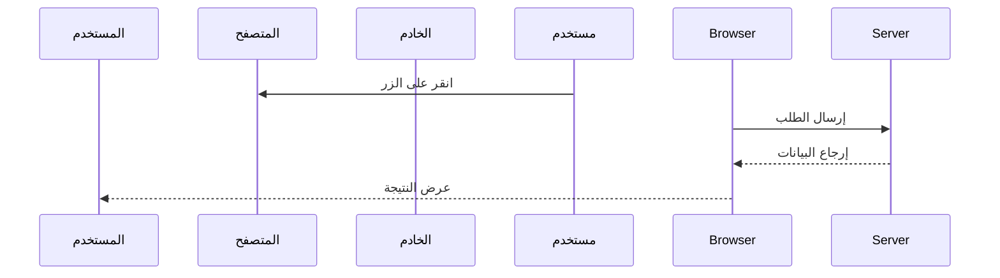
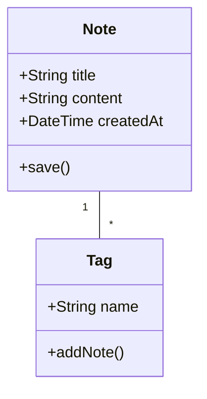
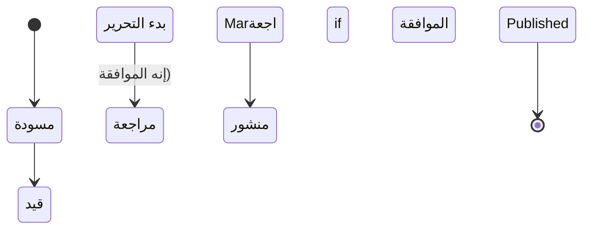
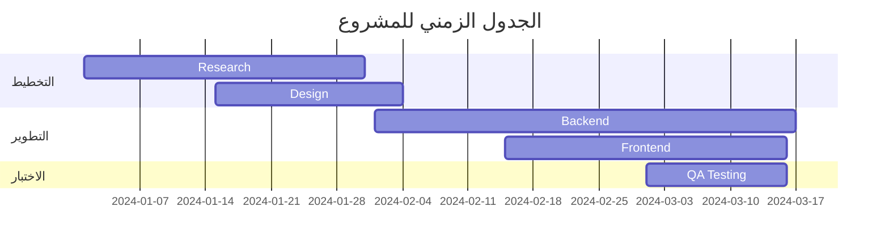
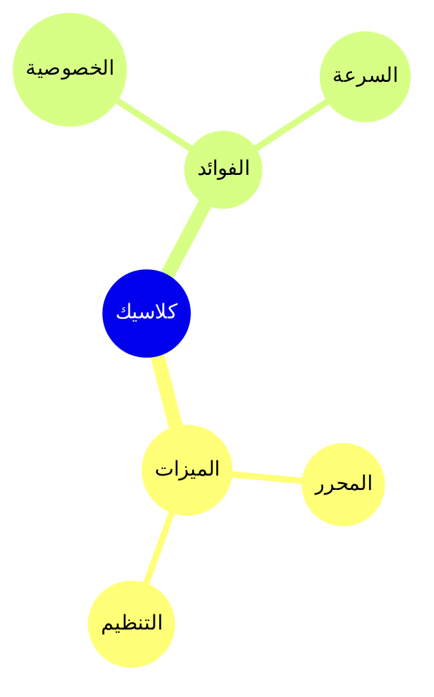

# مخططات Mermaid (أنشئ مخططات جميلة مباشية في ملاحظاتك باست بناء جملة Mermaid.

## الاستخدام الأساسي

لإنشاء مخطط Mermaid، استخدم كتلة الكود مع معرف اللغة `mermaid`،```mermaid
graph TD
    A[البداية] --> B[العملية]
    B --> C[النهاية]
```

## مخطط التدفق
```mermaid
flowchart TD
    A[البداية] --> B{هل يعمل؟}
    B -->|نعم| C[رائع!]
    B -->|لا| D[تصحيح أخطاء)
    D --> B
```
## مخطط التسلس


## مخطط الفئة


## مخطط الحالة

## مخطط Gantt

## مخطط الدائري


## مخطط خريطة الذهنية



## نصائح

### التنسيق
- استخدم المخططات الفرعية لتنظيم المخططات المعقدة

- أضف الأنماط والسمات للتنظيم البصري
- حافظ على المخططات بسيطة قابيلة
- فكر في تقسيم المخططات المعقدة إلى مخططات أصغر
- استخدم `%%{init: ...}%%` للتكوين
### المشاكل الشائعة

**المخطط لا يُعرض؟؟**
- تحقق من بناء جملة Mermaid
- تأكد من أن كتلة الكود تحتوي على لغة `mermaid`
- ابحث عن أخطاء في المعاينة


- **المخطط صغير/كبير جدا؟**
- استخدم `%%{init: {'theme': 'base', 'themeVariables': { 'fontSize': '16px' }}}%%` لضبط الحجم
## الموارد

- [Mermaid Documentation](https://mermaid.js.org/)
- [Mermaid Live Editor](https://mermaid.live/)
- [Mermaid GitHub](https://github.com/mermaid-js/mermaid)
