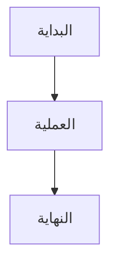

# مرجع Markdown

يدعم كلاسيك بناء جملة Markdown الكامل مع المعاينة المباشرة. إليك مرجع شامل لجميع خيارات التنسيق المدعومة.

## التنسيق الأساسي

| البنية | النتيجة |
|--------|---------|
| `**عريض**` | **عريض** |
| `*مائل*` | *مائل* |
| `~~يتوسطه خط~~` | ~~يتوسطه خط~~ |
| `# عنوان 1` | عنوان 1 |
| `## عنوان 2` | عنوان 2 |
| `### عنوان 3` | عنوان 3 |

## الروابط

```markdown
[رابط مضمّن](https://classic.app)

[رابط بنمط المرجع][https://classic.app]
```

## القوائم

```markdown
- عنصر 1
- عنصر 2
  - عنصر فرعي 2a
    - عنصر فرعي 2a
- عنصر 3

1. العنصر الأول
2. العنصر الثاني
3. العنصر الثالث
```

## كتل الكود

كود مضمّن `code`:

```javascript
const greeting = "مرحباً بالعالم!";
console.log(greeting);
```

كتلة كود مع لغة:

```python
def greet(name):
    return f"مرحباً، {name}!"

print(greet("كلاسيك"))
```

## الاقتباسات

```markdown
> هذا اقتباس.
> يمكن أن يحتوي على فقرات متعددة.
>
> — شخص مشهور
```

## خط أفقي

```markdown
---
```

## الجداول

| الميزة | الحالة |
| ------ | ------ |
| Markdown | ✅ دعم كامل |
| المعاينة المباشرة | ✅ نعم |
| أوامر الشرطة المائلة | ✅ نعم |

## قوائم المهام

```markdown
- [x] المهمة 1
- [ ] المهمة 2
- [x] المهمة 3
```

## الصور

```markdown

```

## الحواشي السفلية

إليك بعض النص مع حاشية سفلية.[^1]

[^1]: هذه هي الحاشية السفلية.
```

## أحرف الهروب

| الحرف | الهروب | النتيجة |
|-------|--------|---------|
| `<` | `&lt;` | `<` |
| `>` | `&gt;` | `>` |
| `&` | `&amp;` | `&` |

## الميزات المتقدمة

### مخططات Mermaid

إنشاء مخططات باستخدام بناء جملة Mermaid:



### المعادلات الرياضية

استخدم KaTeX للتعبيرات الرياضية:

```markdown
$$E = mc^2$$
```

رياضيات مضمّنة: $E = mc^2$

### تمييز بناء الجملة

يدعم كلاسيك تمييز بناء الجملة لأكثر من 100 لغة برمجة.
