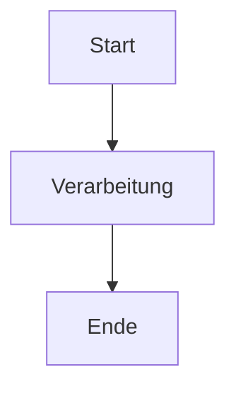
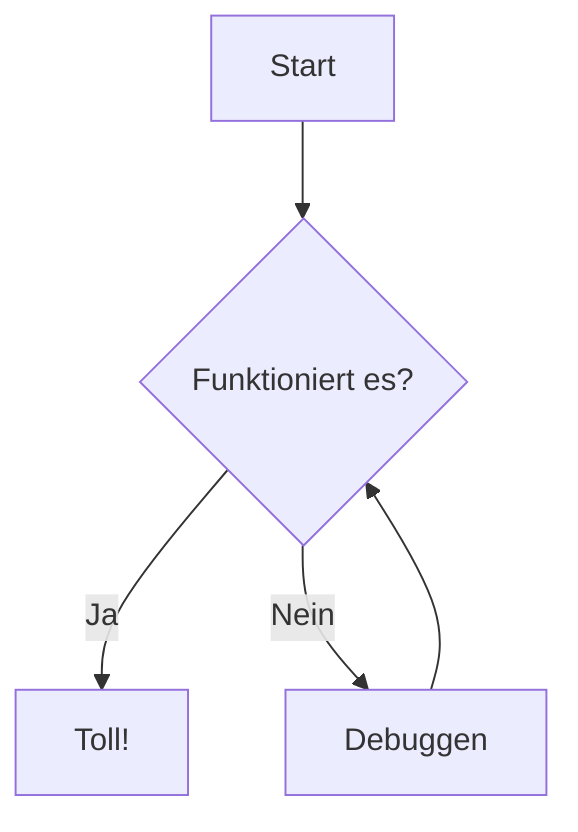
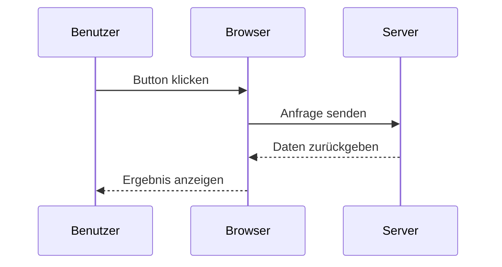
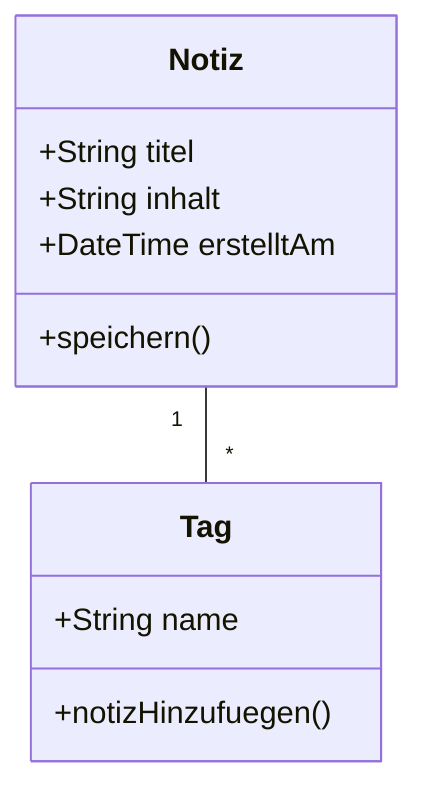
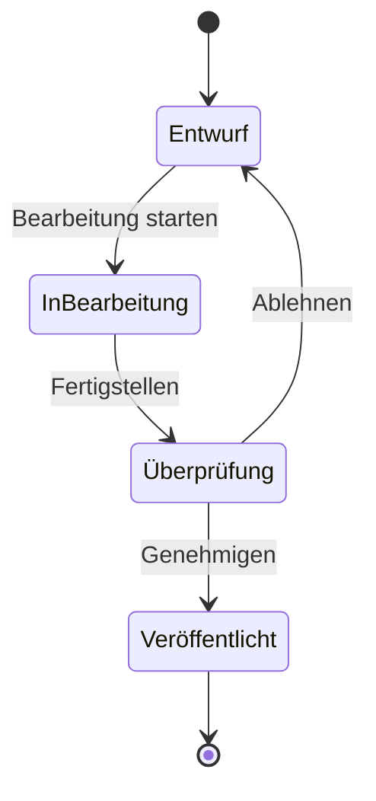
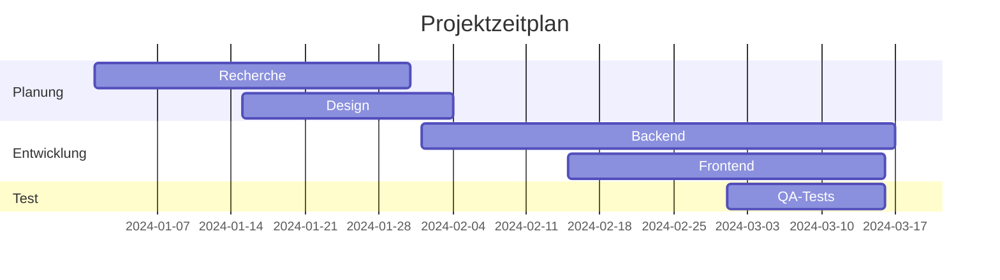
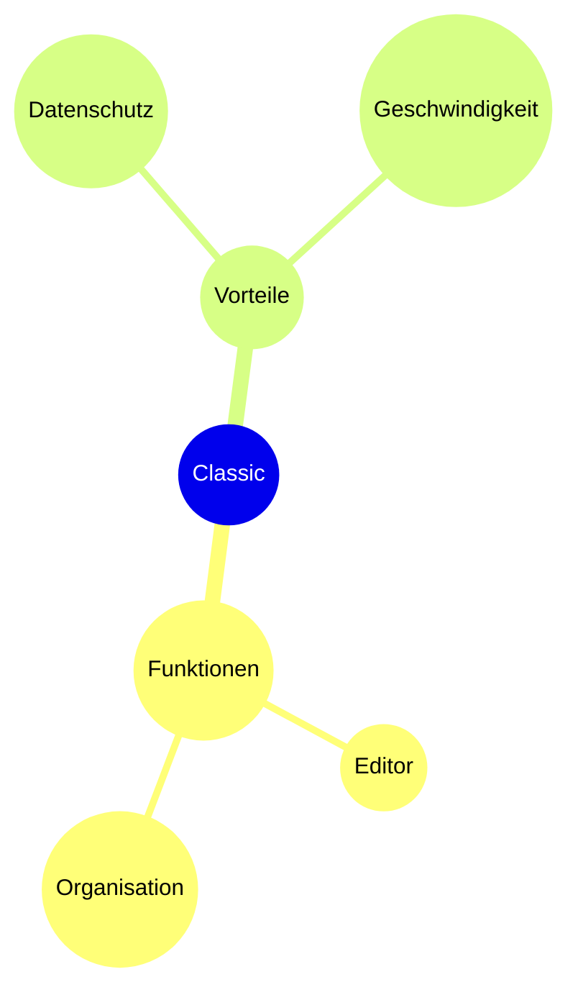

# Mermaid-Diagramme

Erstellen Sie schöne Diagramme direkt in Ihren Notizen mit Mermaid-Syntax.

## Grundlegende Verwendung

Um ein Mermaid-Diagramm zu erstellen, verwenden Sie einen Codeblock mit dem `mermaid` Sprachkennzeichner:

## Flussdiagramm

## Sequenzdiagramm

## Klassendiagramm

## Zustandsdiagramm

## Gantt-Diagramm

## Tortendiagramm

## Mindmap

## Tipps

### Gestaltung

- Verwenden Sie Subgraphen, um komplexe Diagramme zu organisieren
- Fügen Sie Stile und Themen für visuelle Konsistenz hinzu
- Halten Sie Diagramme einfach und lesbar

### Leistung

- Große Diagramme können den Editor verlangsamen
- Erwägen Sie, komplexe Diagramme in kleinere aufzuteilen
- Verwenden Sie `%%{init: ... }%%` für Konfiguration

### Häufige Probleme

**Diagramm wird nicht gerendert?**
- Überprüfen Sie die Mermaid-Syntax
- Stellen Sie sicher, dass der Codeblock die `mermaid` Sprachkennzeichnung hat
- Suchen Sie nach Syntaxfehlern in der Vorschau

**Diagramm zu klein/groß?**
- Verwenden Sie `%%{init: {'theme': 'base', 'themeVariables': { 'fontSize': '16px' }}}%%` zur Größenanpassung

## Ressourcen

- [Mermaid-Dokumentation](https://mermaid.js.org/)
- [Mermaid Live Editor](https://mermaid.live/)
- [Mermaid GitHub](https://github.com/mermaid-js/mermaid)
