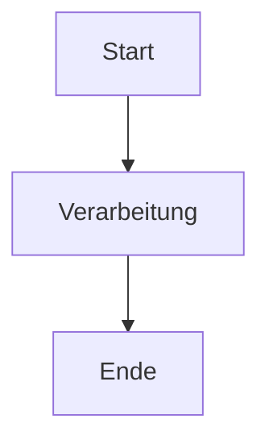

# Markdown-Referenz

Classic unterstützt die vollständige Markdown-Syntax mit Live-Vorschau. Hier ist eine umfassende Referenz für alle unterstützten Formatierungsoptionen.

## Grundlegende Formatierung

| Syntax | Ergebnis |
|-------|----------|
| `**fett**` | **fett** |
| `*kursiv*` | *kursiv* |
| `~~durchgestrichen~~` | ~~durchgestrichen~~ |
| `# Überschrift 1` | Überschrift 1 |
| `## Überschrift 2` | Überschrift 2 |
| `### Überschrift 3` | Überschrift 3 |

## Links

```markdown
[Inline-Link](https://classic.app)

[Referenz-Link][https://classic.app]
```

## Listen

```markdown
- Element 1
- Element 2
  - Verschachteltes Element 2a
    - Weiter verschachteltes Element 2a
- Element 3

1. Erstes Element
2. Zweites Element
3. Drittes Element
```

## Codeblöcke

Inline-`Code`:

```javascript
const greeting = "Hallo, Welt!";
console.log(greeting);
```

Codeblock mit Sprache:

```python
def greet(name):
    return f"Hallo, {name}!"

print(greet("Classic"))
```

## Blockzitate

```markdown
> Dies ist ein Blockzitat.
> Es kann mehrere Absätze enthalten.
>
> — Jemand Berühmtes
```

## Horizontale Linie

```markdown
---
```

## Tabellen

| Funktion | Status |
| -------- | ------ |
| Markdown | ✅ Vollständige Unterstützung |
| Live-Vorschau | ✅ Ja |
| Schrägstrich-Befehle | ✅ Ja |

## Aufgabenlisten

```markdown
- [x] Aufgabe 1
- [ ] Aufgabe 2
- [x] Aufgabe 3
```

## Bilder

```markdown

```

## Fußnoten

Hier ist etwas Text mit einer Fußnote.[^1]

[^1]: Dies ist die Fußnote.

## Zeichen maskieren

| Zeichen | Maskierung | Ergebnis |
|---------|------------|----------|
| `<` | `&lt;` | `<` |
| `>` | `&gt;` | `>` |
| `&` | `&amp;` | `&` |

## Erweiterte Funktionen

### Mermaid-Diagramme

Erstellen Sie Diagramme mit Mermaid-Syntax:



### Mathematische Gleichungen

Verwenden Sie KaTeX für mathematische Ausdrücke:

```markdown
$$E = mc^2$$
```

Inline-Mathematik: $E = mc^2$

### Syntaxhervorhebung

Classic unterstützt Syntaxhervorhebung für über 100 Programmiersprachen.
