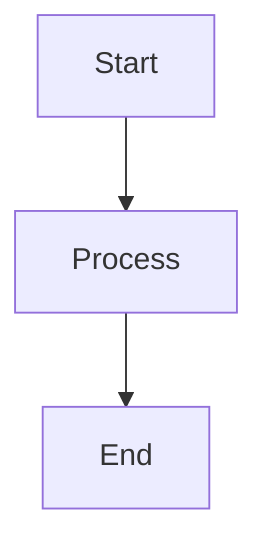
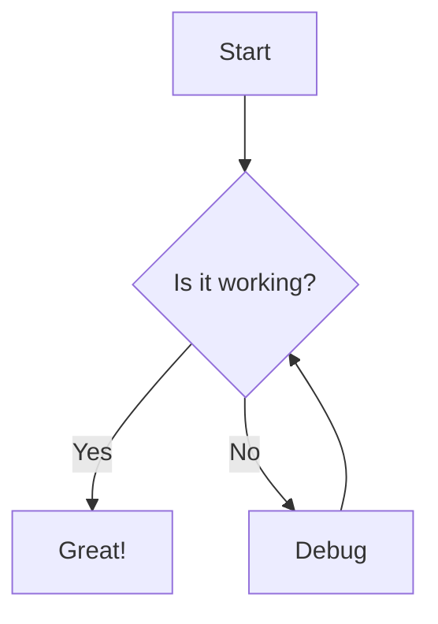
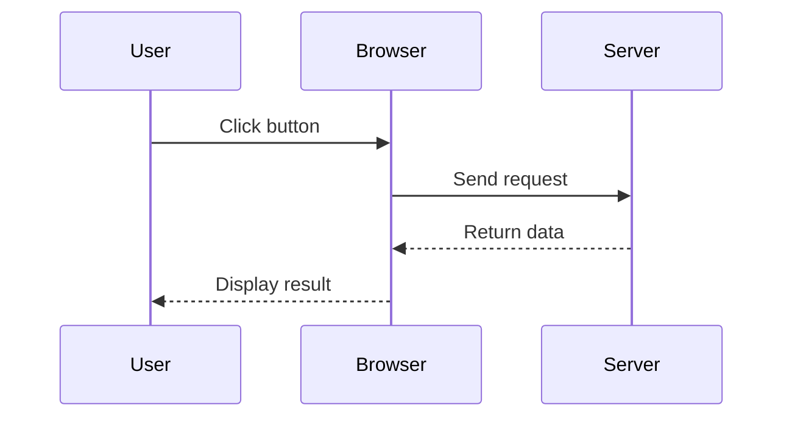
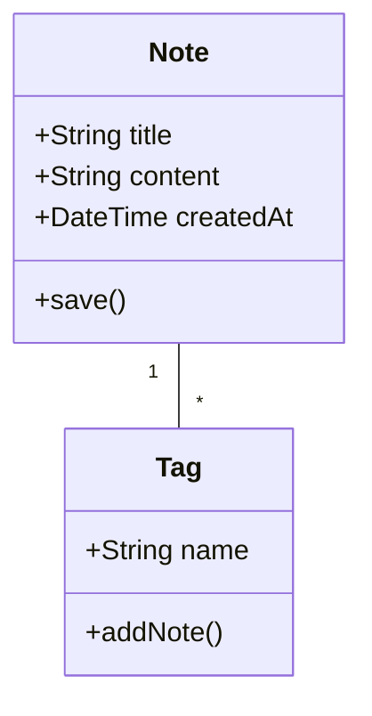
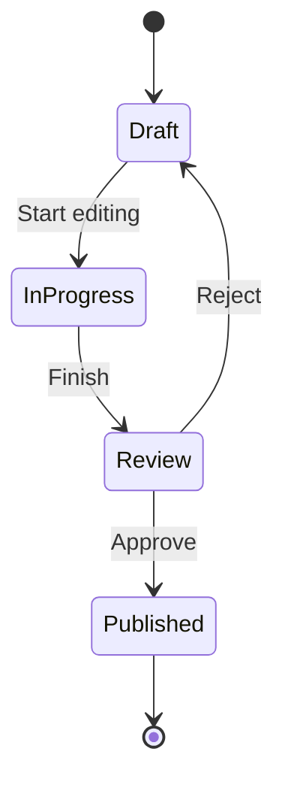
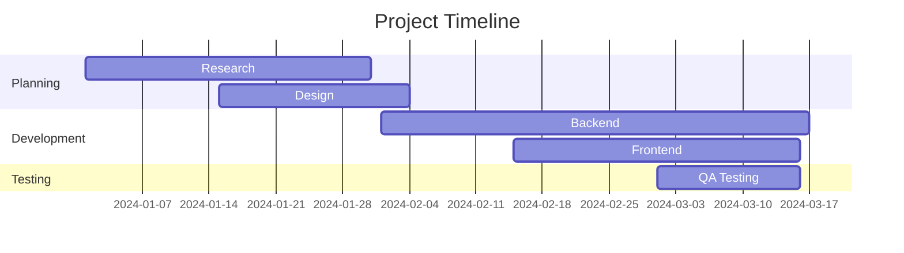
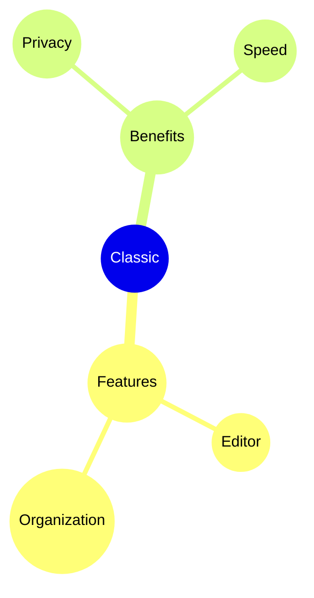

# Mermaid Diagrams

Create beautiful diagrams directly in your notes using Mermaid syntax.

## Basic Usage

To create a Mermaid diagram, use a code block with the `mermaid` language identifier:

## Flowchart

## Sequence Diagram

## Class Diagram

## State Diagram

## Gantt Chart

## Pie Chart

## Mind Map

## Tips

### Styling

- Use subgraphs to organize complex diagrams
- Add styles and themes for visual consistency
- Keep diagrams simple and readable

### Performance

- Large diagrams may slow down the editor
- Consider breaking complex diagrams into smaller ones
- Use `%%{init: ... }%%` for configuration

### Common Issues

**Diagram not rendering?**
- Check Mermaid syntax
- Ensure the code block has `mermaid` language
- Look for syntax errors in the preview

**Diagram too small/large?**
- Use `%%{init: {'theme': 'base', 'themeVariables': { 'fontSize': '16px' }}}%%` to adjust size

## Resources

- [Mermaid Documentation](https://mermaid.js.org/)
- [Mermaid Live Editor](https://mermaid.live/)
- [Mermaid GitHub](https://github.com/mermaid-js/mermaid)
