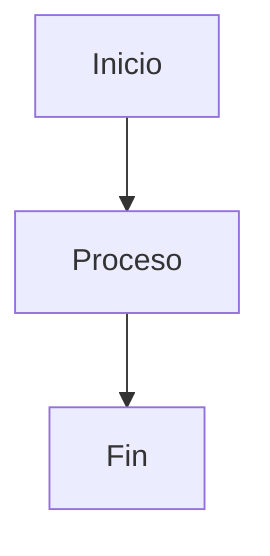
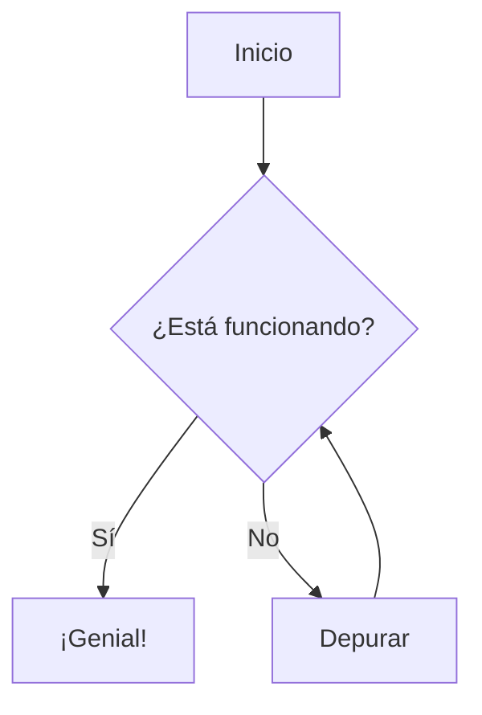
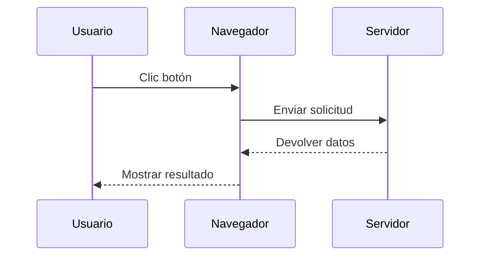
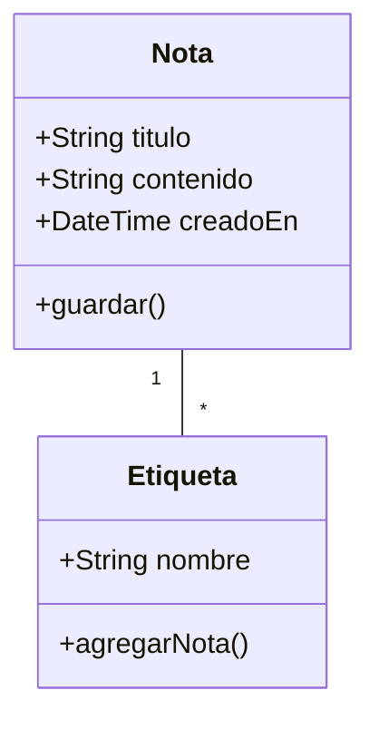
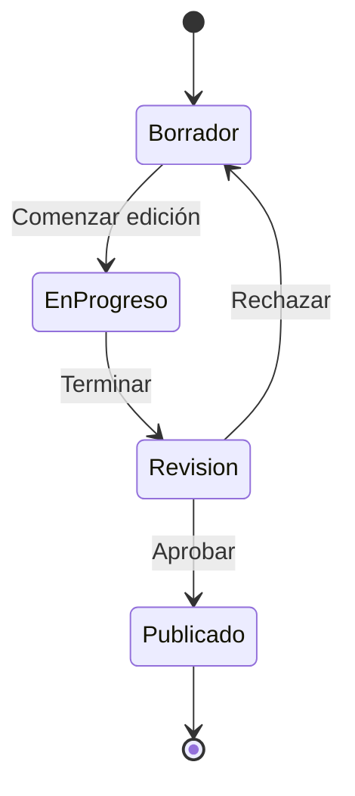
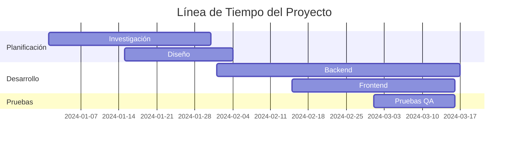
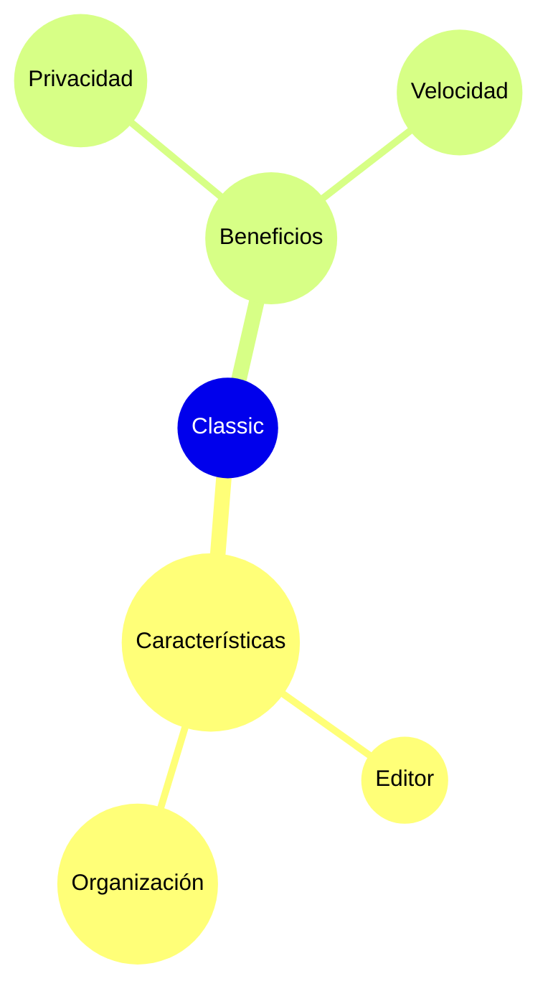

# Diagramas Mermaid

Crea hermosos diagramas directamente en tus notas usando sintaxis Mermaid.

## Uso Básico

Para crear un diagrama Mermaid, usa un bloque de código con el identificador de lenguaje `mermaid`:

## Diagrama de Flujo

## Diagrama de Secuencia

## Diagrama de Clases

## Diagrama de Estados

## Diagrama de Gantt

## Gráfico Circular

## Mapa Mental

## Consejos

### Estilo

- Usa subgrafos para organizar diagramas complejos
- Agrega estilos y temas para consistencia visual
- Mantén los diagramas simples y legibles

### Rendimiento

- Los diagramas grandes pueden ralentizar el editor
- Considera dividir diagramas complejos en otros más pequeños
- Usa `%%{init: ... }%%` para configuración

### Problemas Comunes

**¿El diagrama no se renderiza?**
- Verifica la sintaxis Mermaid
- Asegúrate de que el bloque de código tenga el lenguaje `mermaid`
- Busca errores de sintaxis en la vista previa

**¿Diagrama demasiado pequeño/grande?**
- Usa `%%{init: {'theme': 'base', 'themeVariables': { 'fontSize': '16px' }}}%%` para ajustar el tamaño

## Recursos

- [Documentación de Mermaid](https://mermaid.js.org/)
- [Editor en Vivo de Mermaid](https://mermaid.live/)
- [GitHub de Mermaid](https://github.com/mermaid-js/mermaid)
