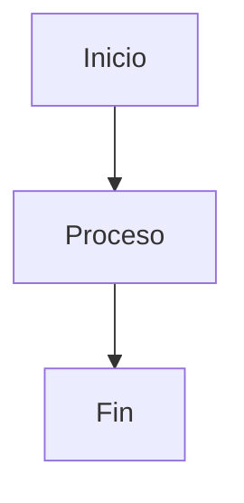

# Referencia de Markdown

Classic soporta sintaxis Markdown completa con vista previa en vivo. Aquí tienes una referencia completa de todas las opciones de formato soportadas.

## Formato Básico

| Sintaxis | Resultado |
|----------|-----------|
| `**negrita**` | **negrita** |
| `*cursiva*` | *cursiva* |
| `~~tachado~~` | ~~tachado~~ |
| `# Encabezado 1` | Encabezado 1 |
| `## Encabezado 2` | ## Encabezado 2 |
| `### Encabezado 3` | ### Encabezado 3 |

## Enlaces

```markdown
[Enlace en línea](https://classic.app)

[Enlace estilo referencia][https://classic.app]
```

## Listas

```markdown
- Elemento 1
- Elemento 2
  - Elemento anidado 2a
    - Elemento anidado 2a
- Elemento 3

1. Primer elemento
2. Segundo elemento
3. Tercer elemento
```

## Bloques de Código

Código en línea `código`:

```javascript
const greeting = "¡Hola, Mundo!";
console.log(greeting);
```

Bloque de código con lenguaje:

```python
def greet(name):
    return f"¡Hola, {name}!"

print(greet("Classic"))
```

## Citas en Bloque

```markdown
> Esta es una cita en bloque.
> Puede contener múltiples párrafos.
>
> — Alguien famoso
```

## Regla Horizontal

```markdown
---
```

## Tablas

| Característica | Estado |
| -------------- | ------ |
| Markdown | ✅ Soporte completo |
| Vista Previa en Vivo | ✅ Sí |
| Comandos con Barra | ✅ Sí |

## Listas de Tareas

```markdown
- [x] Tarea 1
- [ ] Tarea 2
- [x] Tarea 3
```

## Imágenes

```markdown

```

## Notas al Pie

Aquí hay algún texto con una nota al pie.[^1]

[^1]: Esta es la nota al pie.
```

## Caracteres de Escape

| Carácter | Escape | Resultado |
|----------|--------|-----------|
| `<` | `&lt;` | `<` |
| `>` | `&gt;` | `>` |
| `&` | `&amp;` | `&` |

## Características Avanzadas

### Diagramas Mermaid

Crea diagramas usando sintaxis Mermaid:



### Ecuaciones Matemáticas

Usa KaTeX para expresiones matemáticas:

```markdown
$$E = mc^2$$
```

Matemáticas en línea: $E = mc^2$

### Resaltado de Sintaxis

Classic soporta resaltado de sintaxis para más de 100 lenguajes de programación.
