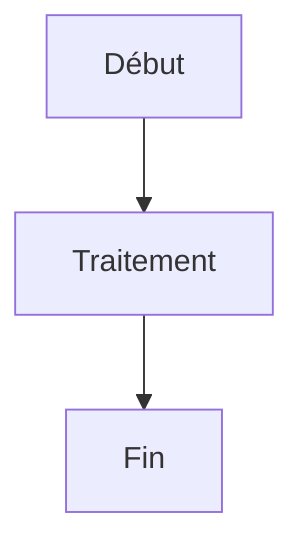
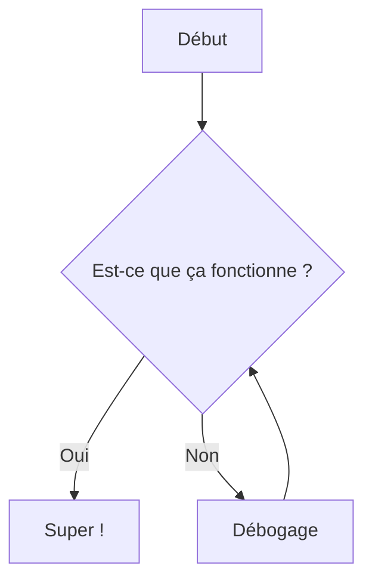
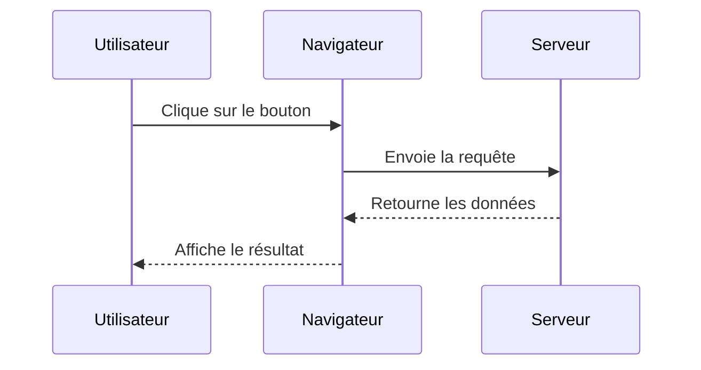
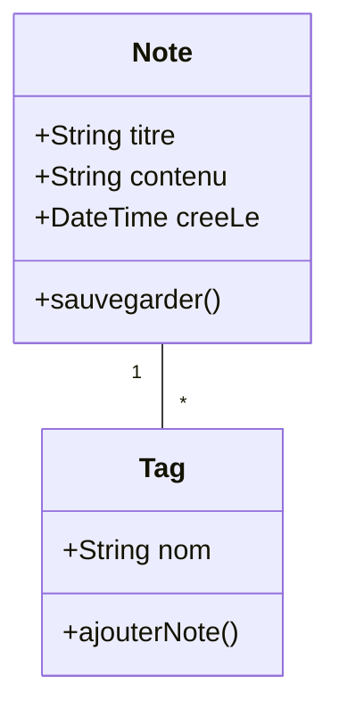
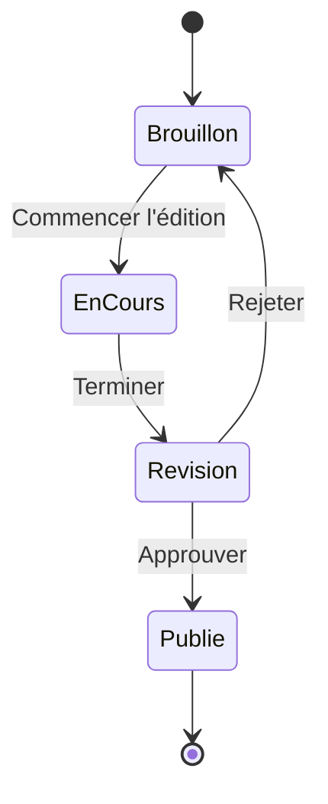
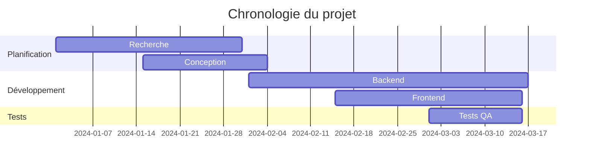
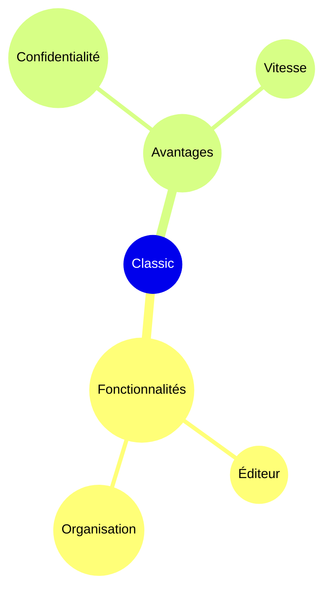

# Diagrammes Mermaid

Créez de beaux diagrammes directement dans vos notes en utilisant la syntaxe Mermaid.

## Utilisation de base

Pour créer un diagramme Mermaid, utilisez un bloc de code avec l'identifiant de langage `mermaid` :

## Organigramme

## Diagramme de séquence

## Diagramme de classes

## Diagramme d'état

## Diagramme de Gantt

## Diagramme circulaire

## Carte mentale

## Conseils

### Style

- Utilisez des sous-graphes pour organiser les diagrammes complexes
- Ajoutez des styles et des thèmes pour une cohérence visuelle
- Gardez les diagrammes simples et lisibles

### Performance

- Les grands diagrammes peuvent ralentir l'éditeur
- Envisagez de diviser les diagrammes complexes en plus petits
- Utilisez `%%{init: ... }%%` pour la configuration

### Problèmes courants

**Le diagramme ne s'affiche pas ?**
- Vérifiez la syntaxe Mermaid
- Assurez-vous que le bloc de code a le langage `mermaid`
- Recherchez les erreurs de syntaxe dans l'aperçu

**Diagramme trop petit/grand ?**
- Utilisez `%%{init: {'theme': 'base', 'themeVariables': { 'fontSize': '16px' }}}%%` pour ajuster la taille

## Ressources

- [Documentation Mermaid](https://mermaid.js.org/)
- [Éditeur Mermaid en ligne](https://mermaid.live/)
- [GitHub Mermaid](https://github.com/mermaid-js/mermaid)
