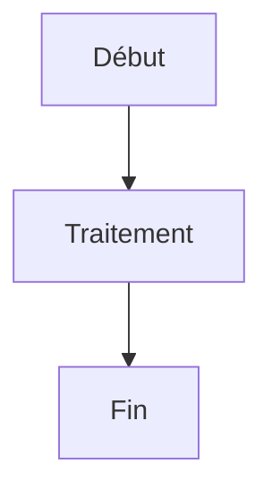

# Référence Markdown

Classic prend en charge la syntaxe Markdown complète avec aperçu en direct. Voici une référence complète de toutes les options de formatage prises en charge.

## Formatage de base

| Syntaxe | Résultat |
|---------|----------|
| `**gras**` | **gras** |
| `*italique*` | *italique* |
| `~~barré~~` | ~~barré~~ |
| `# Titre 1` | Titre 1 |
| `## Titre 2` | ## Titre 2 |
| `### Titre 3` | ### Titre 3 |

## Liens

```markdown
[Lien en ligne](https://classic.app)

[Lien de type référence][https://classic.app]
```

## Listes

```markdown
- Élément 1
- Élément 2
  - Élément imbriqué 2a
    - Élément imbriqué 2a
- Élément 3

1. Premier élément
2. Deuxième élément
3. Troisième élément
```

## Blocs de code

Code en ligne `code` :

```javascript
const greeting = "Hello, World!";
console.log(greeting);
```

Bloc de code avec langage :

```python
def greet(name):
    return f"Hello, {name}!"

print(greet("Classic"))
```

## Citations

```markdown
> Ceci est une citation.
> Elle peut contenir plusieurs paragraphes.
>
> — Quelqu'un de célèbre
```

## Ligne horizontale

```markdown
---
```

## Tableaux

| Fonctionnalité | Statut |
| -------------- | ------ |
| Markdown | ✅ Support complet |
| Aperçu en direct | ✅ Oui |
| Commandes slash | ✅ Oui |

## Listes de tâches

```markdown
- [x] Tâche 1
- [ ] Tâche 2
- [x] Tâche 3
```

## Images

```markdown

```

## Notes de bas de page

Voici du texte avec une note de bas de page.[^1]

[^1]: Ceci est la note de bas de page.
```

## Caractères d'échappement

| Caractère | Échappement | Résultat |
|-----------|-------------|----------|
| `<` | `&lt;` | `<` |
| `>` | `&gt;` | `>` |
| `&` | `&amp;` | `&` |

## Fonctionnalités avancées

### Diagrammes Mermaid

Créez des diagrammes en utilisant la syntaxe Mermaid :



### Équations mathématiques

Utilisez KaTeX pour les expressions mathématiques :

```markdown
$$E = mc^2$$
```

Mathématiques en ligne : $E = mc^2$

### Coloration syntaxique

Classic prend en charge la coloration syntaxique pour plus de 100 langages de programmation.
