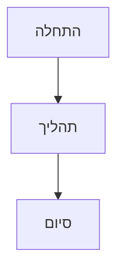
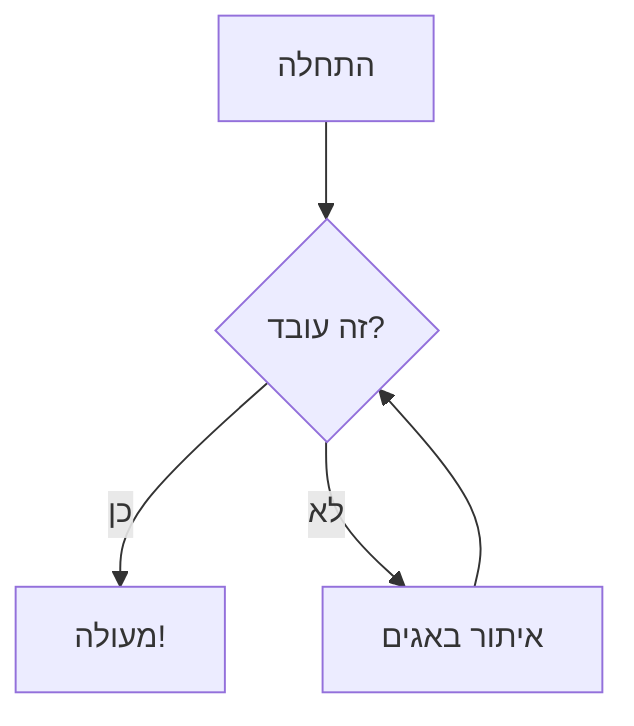
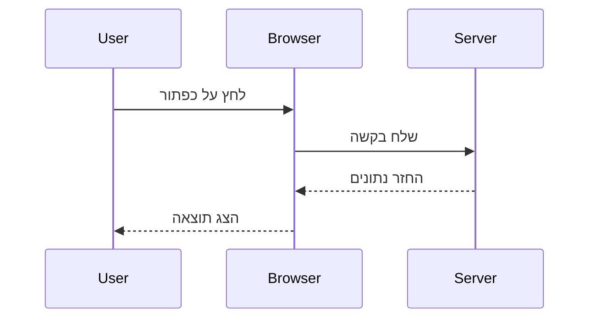
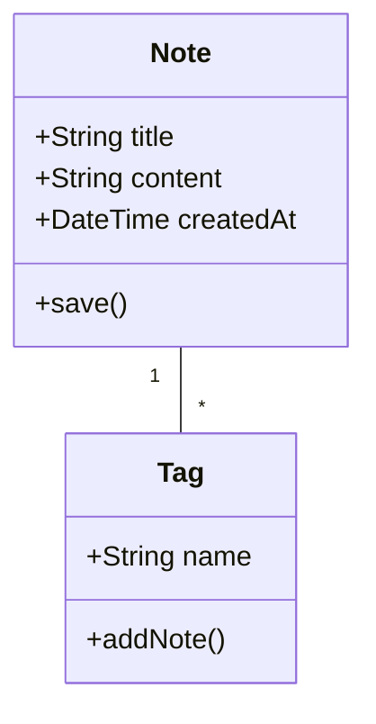
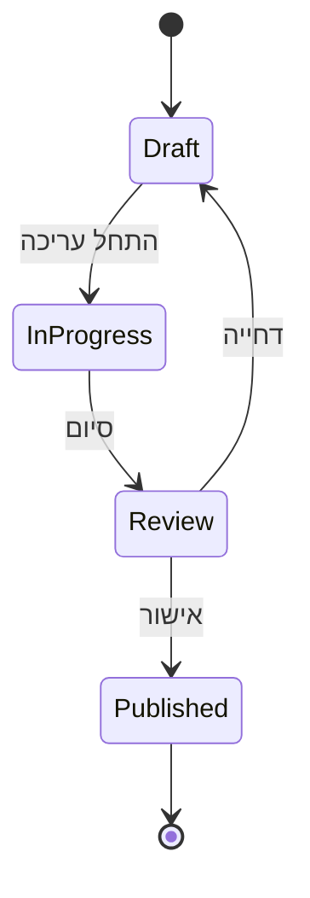
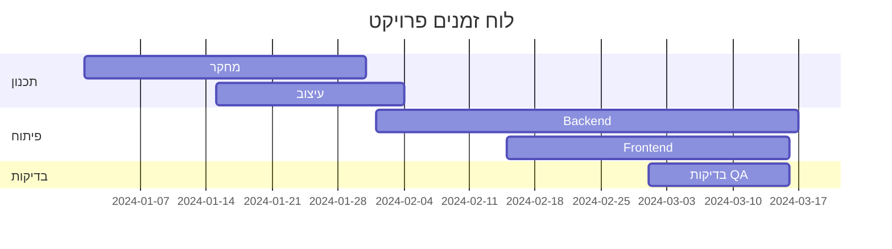
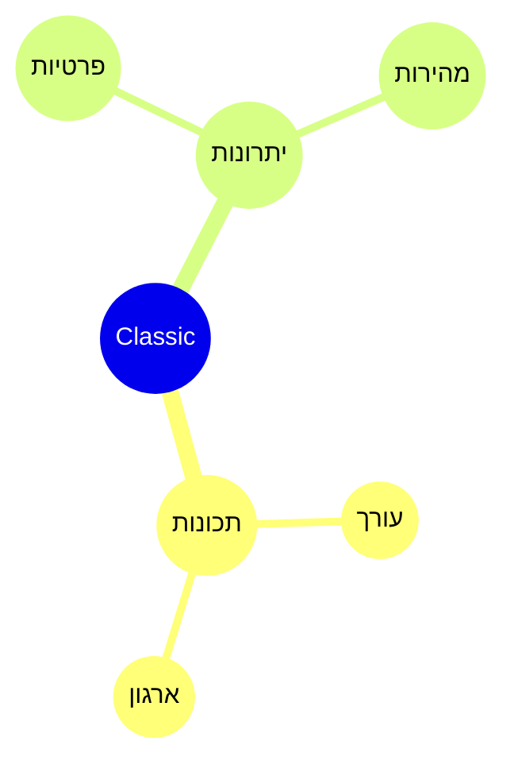

# דיאגרמות Mermaid

צרו דיאגרמות יפות ישירות בהערות שלכם באמצעות תחביר Mermaid.

## שימוש בסיסי

ליצירת דיאגרמת Mermaid, השתמשו בבלוק קוד עם מזהה השפה `mermaid`:

## תרשים זרימה

## דיאגרמת רצף

## דיאגרמת מחלקות

## דיאגרמת מצבים

## תרשים Gantt

## תרשים עוגה

## מפת חשיבה

## טיפים

### עיצוב

- השתמשו בתת-גרפים לארגון דיאגרמות מורכבות
- הוסיפו סגנונות וערכות נושא לעקביות חזותית
- שמרו על דיאגרמות פשוטות וקריאות

### ביצועים

- דיאגרמות גדולות עלולות להאט את העורך
- שקלו לפצל דיאגרמות מורכבות לקטנות יותר
- השתמשו ב-`%%{init: ... }%%` להגדרות

### בעיות נפוצות

**הדיאגרמה לא מתעבדת?**
- בדקו את תחביר Mermaid
- ודאו שלבלוק הקוד יש שפת `mermaid`
- חפשו שגיאות תחביר בתצוגה המקדימה

**הדיאגרמה קטנה/גדולה מדי?**
- השתמשו ב-`%%{init: {'theme': 'base', 'themeVariables': { 'fontSize': '16px' }}}%%` להתאמת גודל

## משאבים

- [תיעוד Mermaid](https://mermaid.js.org/)
- [עורך Mermaid Live](https://mermaid.live/)
- [Mermaid ב-GitHub](https://github.com/mermaid-js/mermaid)
