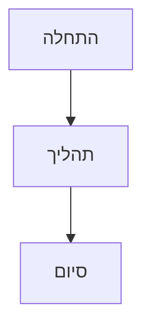

# מדריך Markdown

Classic תומך בתחביר Markdown מלא עם תצוגה מקדימה בזמן אמת. הנה מדריך מקיף לכל אפשרויות העיצוב הנתמכות.

## עיצוב בסיסי

| תחביר | תוצאה |
|-------|--------|
| `**מודגש**` | **מודגש** |
| `*נטוי*` | *נטוי* |
| `~~קו חוצה~~` | ~~קו חוצה~~ |
| `# כותרת 1` | כותרת 1 |
| `## כותרת 2` | ## כותרת 2 |
| `### כותרת 3` | ### כותרת 3 |

## קישורים

```markdown
[קישור בתוך השורה](https://classic.app)

[קישור בסגנון הפניה][https://classic.app]
```

## רשימות

```markdown
- פריט 1
- פריט 2
  - פריט מקונן 2א
    - פריט מקונן 2א
- פריט 3

1. פריט ראשון
2. פריט שני
3. פריט שלישי
```

## בלוקי קוד

קוד בתוך השורה `code`:

```javascript
const greeting = "Hello, World!";
console.log(greeting);
```

בלוק קוד עם שפה:

```python
def greet(name):
    return f"Hello, {name}!"

print(greet("Classic"))
```

## ציטוטים

```markdown
> זהו ציטוט.
> הוא יכול להכיל פסקאות מרובות.
>
> — מישהו מפורסם
```

## קו אופקי

```markdown
---
```

## טבלאות

| תכונה | סטטוס |
| ------ | ------ |
| Markdown | תמיכה מלאה |
| תצוגה מקדימה בזמן אמת | כן |
| פקודות סלאש | כן |

## רשימות משימות

```markdown
- [x] משימה 1
- [ ] משימה 2
- [x] משימה 3
```

## תמונות

```markdown

```

## הערות שוליים

הנה טקסט עם הערת שוליים.[^1]

[^1]: זוהי הערת השוליים.
```

## תווי בריחה

| תו | בריחה | תוצאה |
|-----------|--------|--------|
| `<` | `&lt;` | `<` |
| `>` | `&gt;` | `>` |
| `&` | `&amp;` | `&` |

## תכונות מתקדמות

### דיאגרמות Mermaid

צרו דיאגרמות באמצעות תחביר Mermaid:



### משוואות מתמטיות

השתמשו ב-KaTeX לביטויים מתמטיים:

```markdown
$$E = mc^2$$
```

מתמטיקה בתוך השורה: $E = mc^2$

### הדגשת תחביר

Classic תומך בהדגשת תחביר למעלה מ-100 שפות תכנות.
