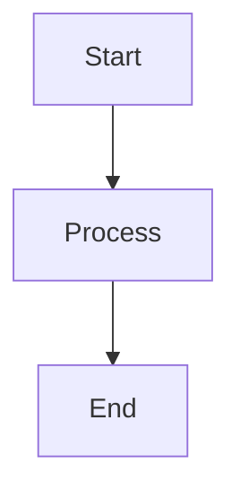
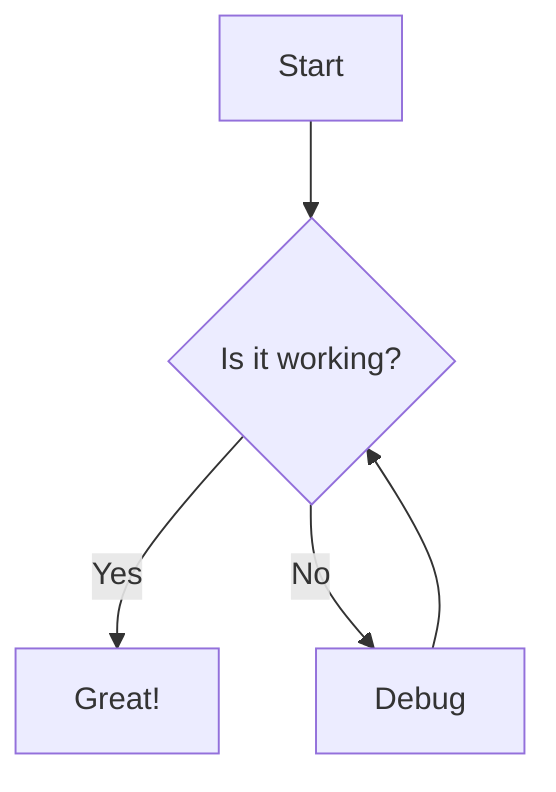
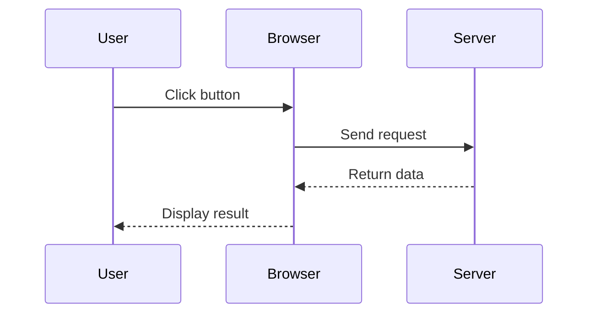
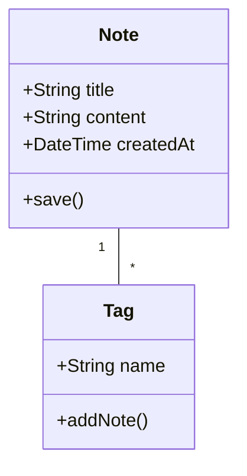
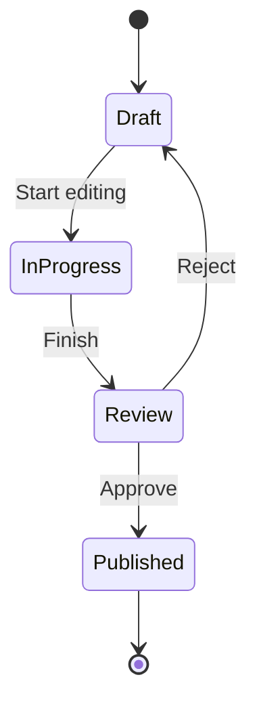
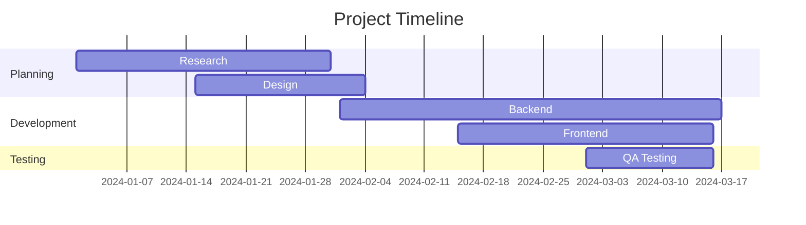
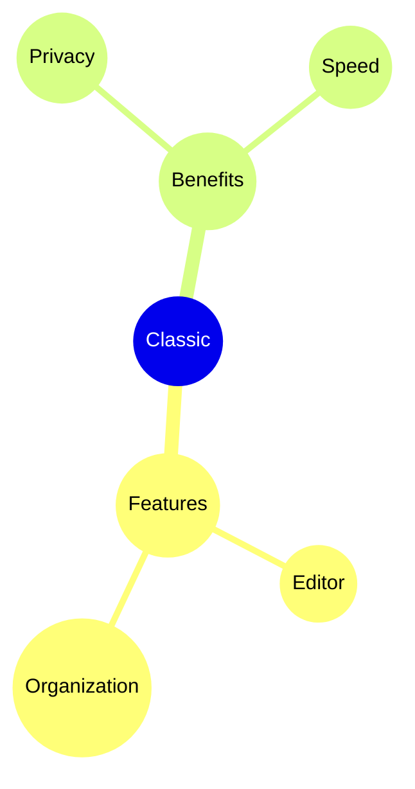

# Mermaid डायग्राम

Mermaid सिंटैक्स का उपयोग करके अपनी नोट्स में सीधे सुंदर डायग्राम बनाएं।

## बुनियादी उपयोग

Mermaid डायग्राम बनाने के लिए, `mermaid` भाषा पहचानकर्ता के साथ एक कोड ब्लॉक का उपयोग करें:

## फ्लोचार्ट

## सीक्वेंस डायग्राम

## क्लास डायग्राम

## स्टेट डायग्राम

## गैंट चार्ट

## पाई चार्ट

## माइंड मैप

## टिप्स

### स्टाइलिंग

- जटिल डायग्राम को व्यवस्थित करने के लिए सबग्राफ़ का उपयोग करें
- दृश्य स्थिरता के लिए स्टाइल और थीम जोड़ें
- डायग्राम को सरल और पठनीय रखें

### प्रदर्शन

- बड़े डायग्राम एडिटर को धीमा कर सकते हैं
- जटिल डायग्राम को छोटे में तोड़ने पर विचार करें
- कॉन्फ़िगरेशन के लिए `%%{init: ... }%%` का उपयोग करें

### सामान्य समस्याएं

**डायग्राम रेंडर नहीं हो रहा?**
- Mermaid सिंटैक्स जांचें
- सुनिश्चित करें कि कोड ब्लॉक में `mermaid` भाषा है
- प्रीव्यू में सिंटैक्स त्रुटियों की तलाश करें

**डायग्राम बहुत छोटा/बड़ा?**
- आकार समायोजित करने के लिए `%%{init: {'theme': 'base', 'themeVariables': { 'fontSize': '16px' }}}%%` का उपयोग करें

## संसाधन

- [Mermaid डॉक्यूमेंटेशन](https://mermaid.js.org/)
- [Mermaid लाइव एडिटर](https://mermaid.live/)
- [Mermaid GitHub](https://github.com/mermaid-js/mermaid)
