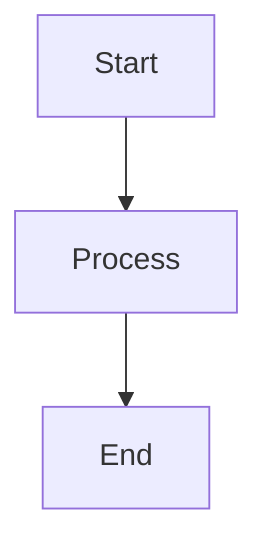

# Markdown संदर्भ

Classic लाइव प्रीव्यू के साथ पूर्ण Markdown सिंटैक्स का समर्थन करता है। सभी समर्थित फ़ॉर्मेटिंग विकल्पों के लिए यहां एक व्यापक संदर्भ है।

## बुनियादी फ़ॉर्मेटिंग

| सिंटैक्स | परिणाम |
|-------|--------|
| `**बोल्ड**` | **बोल्ड** |
| `*इटैलिक*` | *इटैलिक* |
| `~~स्ट्राइकथ्रू~~` | ~~स्ट्राइकथ्रू~~ |
| `# हेडिंग 1` | हेडिंग 1 |
| `## हेडिंग 2` | ## हेडिंग 2 |
| `### हेडिंग 3` | ### हेडिंग 3 |

## लिंक

```markdown
[इनलाइन लिंक](https://classic.app)

[रेफरेंस-स्टाइल लिंक][https://classic.app]
```

## सूचियां

```markdown
- आइटम 1
- आइटम 2
  - नेस्टेड आइटम 2a
    - नेस्टेड आइटम 2a
- आइटम 3

1. पहला आइटम
2. दूसरा आइटम
3. तीसरा आइटम
```

## कोड ब्लॉक्स

इनलाइन `कोड`:

```javascript
const greeting = "Hello, World!";
console.log(greeting);
```

भाषा के साथ कोड ब्लॉक:

```python
def greet(name):
    return f"Hello, {name}!"

print(greet("Classic"))
```

## ब्लॉकक्वोट्स

```markdown
> यह एक ब्लॉकक्वोट है।
> इसमें कई पैराग्राफ़ हो सकते हैं।
>
> — कोई प्रसिद्ध व्यक्ति
```

## हॉरिजॉन्टल रूल

```markdown
---
```

## टेबल्स

| विशेषता | स्थिति |
| ------ | ------ |
| Markdown | ✅ पूर्ण समर्थन |
| लाइव प्रीव्यू | ✅ हाँ |
| स्लैश कमांड | ✅ हाँ |

## टास्क सूचियां

```markdown
- [x] टास्क 1
- [ ] टास्क 2
- [x] टास्क 3
```

## चित्र

```markdown

```

## फ़ुटनोट्स

यहां फ़ुटनोट के साथ कुछ टेक्स्ट है।[^1]

[^1]: यह फ़ुटनोट है।

## कैरेक्टर्स एस्केप करना

| कैरेक्टर | एस्केप | परिणाम |
|-----------|--------|--------|
| `<` | `&lt;` | `<` |
| `>` | `&gt;` | `>` |
| `&` | `&amp;` | `&` |

## उन्नत विशेषताएं

### Mermaid डायग्राम

Mermaid सिंटैक्स का उपयोग करके डायग्राम बनाएं:



### गणित समीकरण

गणितीय अभिव्यक्तियों के लिए KaTeX का उपयोग करें:

```markdown
$$E = mc^2$$
```

इनलाइन गणित: $E = mc^2$

### सिंटैक्स हाइलाइटिंग

Classic 100 से अधिक प्रोग्रामिंग भाषाओं के लिए सिंटैक्स हाइलाइटिंग का समर्थन करता है।
