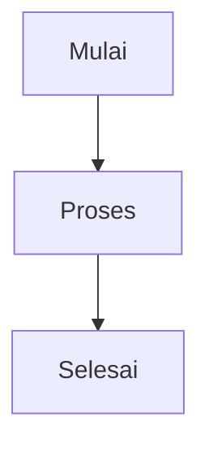
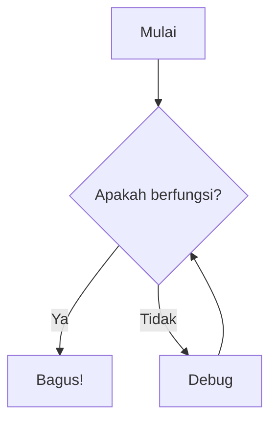
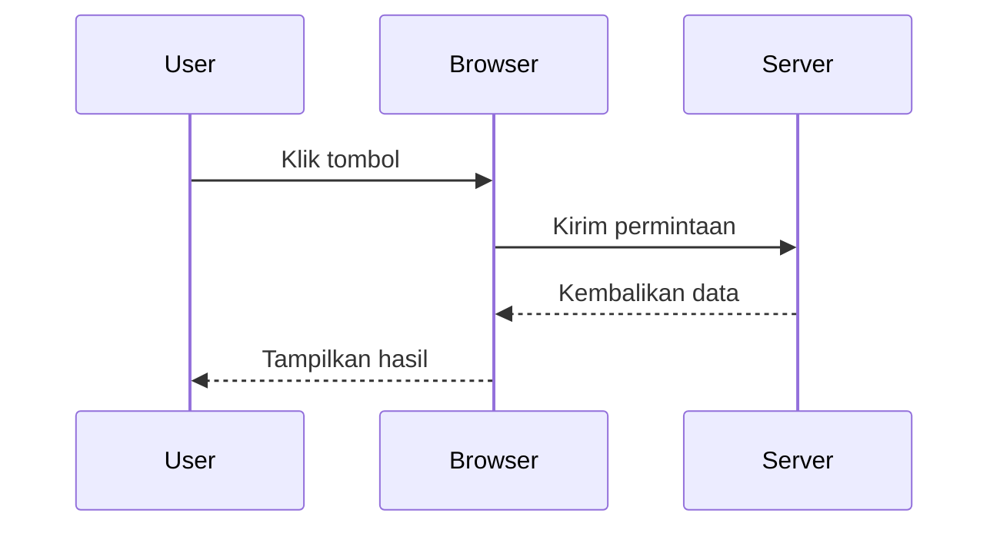
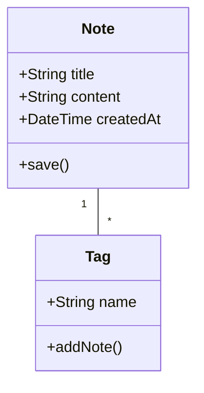
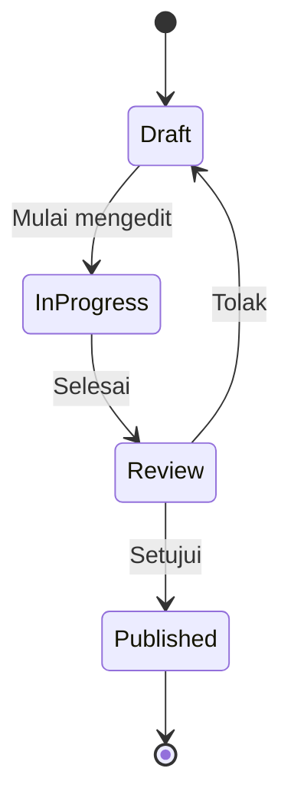
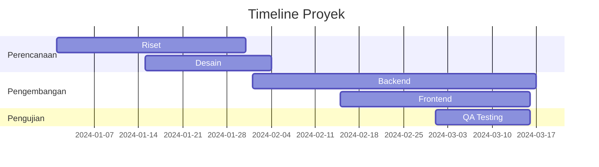
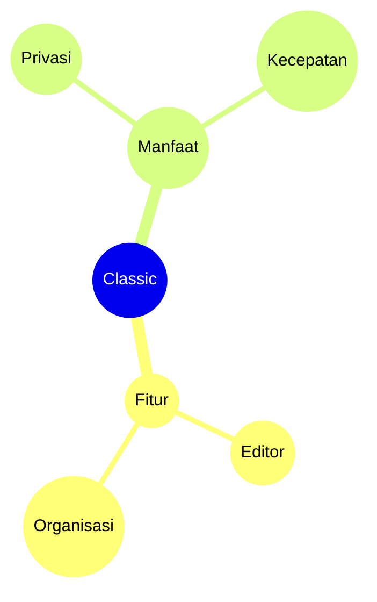

# Diagram Mermaid

Buat diagram indah langsung di catatan Anda menggunakan sintaks Mermaid.

## Penggunaan Dasar

Untuk membuat diagram Mermaid, gunakan blok kode dengan pengenal bahasa `mermaid`:

## Flowchart

## Diagram Urutan

## Diagram Kelas

## Diagram Status

## Bagan Gantt

## Bagan Pai

## Peta Pikiran

## Tips

### Penataan Gaya

- Gunakan subgraf untuk mengatur diagram kompleks
- Tambahkan gaya dan tema untuk konsistensi visual
- Buat diagram tetap sederhana dan mudah dibaca

### Performa

- Diagram besar dapat memperlambat editor
- Pertimbangkan untuk memecah diagram kompleks menjadi yang lebih kecil
- Gunakan `%%{init: ... }%%` untuk konfigurasi

### Masalah Umum

**Diagram tidak dirender?**
- Periksa sintaks Mermaid
- Pastikan blok kode memiliki bahasa `mermaid`
- Cari kesalahan sintaks di pratinjau

**Diagram terlalu kecil/besar?**
- Gunakan `%%{init: {'theme': 'base', 'themeVariables': { 'fontSize': '16px' }}}%%` untuk menyesuaikan ukuran

## Sumber Daya

- [Dokumentasi Mermaid](https://mermaid.js.org/)
- [Editor Mermaid Live](https://mermaid.live/)
- [Mermaid GitHub](https://github.com/mermaid-js/mermaid)
