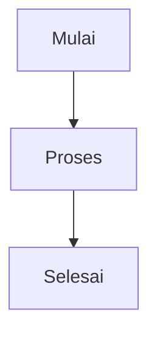

# Referensi Markdown

Classic mendukung sintaks Markdown lengkap dengan pratinjau langsung. Berikut adalah referensi komprehensif untuk semua opsi pemformatan yang didukung.

## Pemformatan Dasar

| Sintaks | Hasil |
| ------- | ----- |
| `**tebal**` | **tebal** |
| `*miring*` | *miring* |
| `~~coret~~` | ~~coret~~ |
| `# Heading 1` | Heading 1 |
| `## Heading 2` | Heading 2 |
| `### Heading 3` | Heading 3 |

## Tautan

```markdown
[Tautan sebaris](https://classic.app)

[Tautan gaya referensi][https://classic.app]
```

## Daftar

```markdown
- Item 1
- Item 2
  - Item bertingkat 2a
    - Item bertingkat 2a-i
- Item 3

1. Item pertama
2. Item kedua
3. Item ketiga
```

## Blok Kode

Kode sebaris `kode`:

```javascript
const greeting = "Halo, Dunia!";
console.log(greeting);
```

Blok kode dengan bahasa:

```python
def greet(name):
    return f"Halo, {name}!"

print(greet("Classic"))
```

## Kutipan Blok

```markdown
> Ini adalah kutipan blok.
> Ini bisa berisi beberapa paragraf.
>
> — Seseorang yang terkenal
```

## Garis Horizontal

```markdown
---
```

## Tabel

| Fitur | Status |
| ----- | ------ |
| Markdown | ✅ Dukungan penuh |
| Pratinjau Langsung | ✅ Ya |
| Perintah Slash | ✅ Ya |

## Daftar Tugas

```markdown
- [x] Tugas 1
- [ ] Tugas 2
- [x] Tugas 3
```

## Gambar

```markdown

```

## Catatan Kaki

```markdown
Berikut adalah beberapa teks dengan catatan kaki.[^1]

[^1]: Ini adalah catatan kaki.
```

## Karakter Escape

| Karakter | Escape | Hasil |
| -------- | ------ | ----- |
| `<` | `&lt;` | `<` |
| `>` | `&gt;` | `>` |
| `&` | `&amp;` | `&` |

## Fitur Lanjutan

### Diagram Mermaid

Buat diagram menggunakan sintaks Mermaid:



### Persamaan Matematika

Gunakan KaTeX untuk ekspresi matematika:

```markdown
$$E = mc^2$$
```

Matematika sebaris: $E = mc^2$

### Penyorotan Sintaks

Classic mendukung penyorotan sintaks untuk lebih dari 100 bahasa pemrograman.
