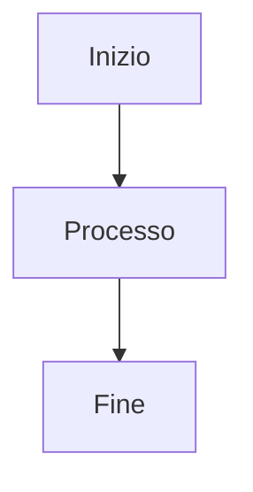
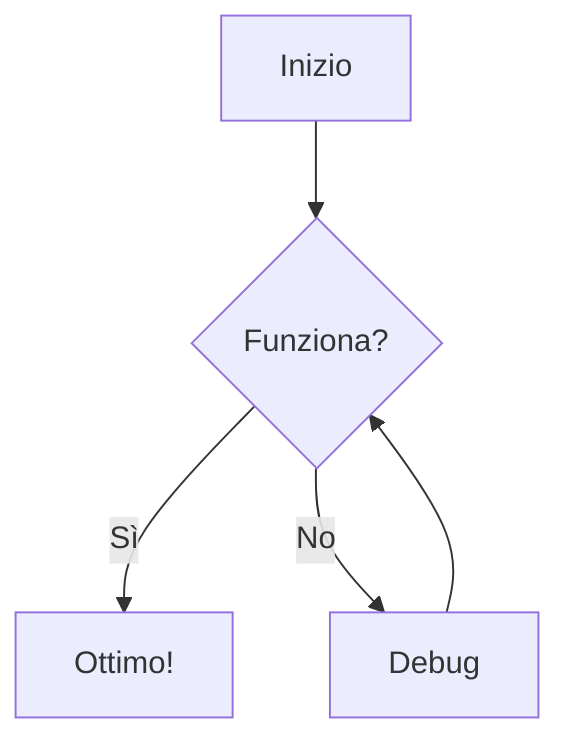
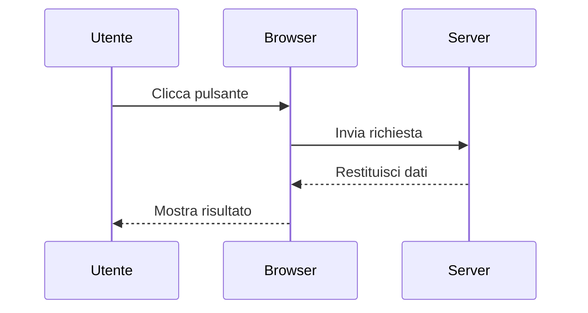
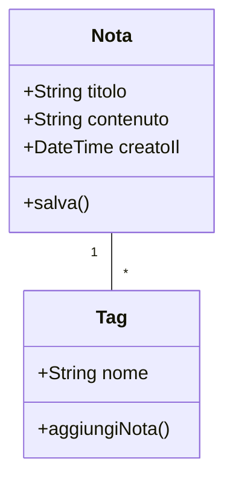
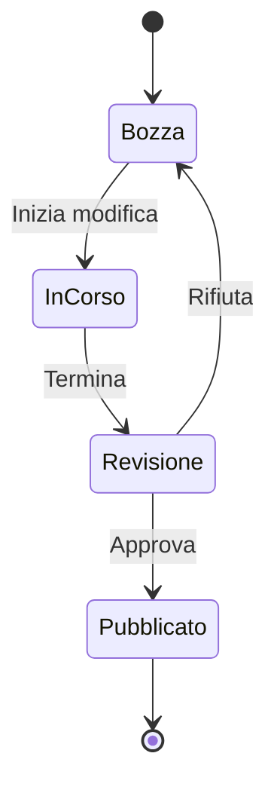
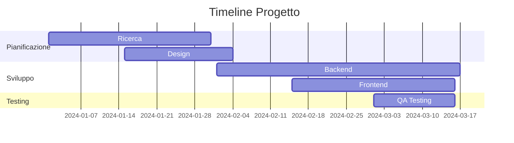
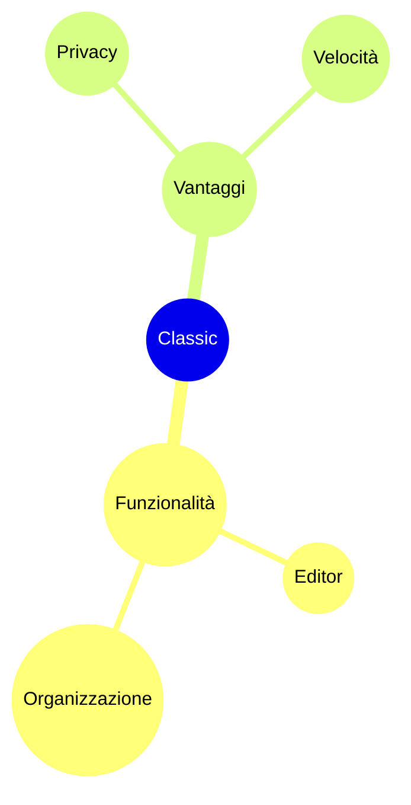

# Diagrammi Mermaid

Crea bellissimi diagrammi direttamente nelle tue note usando la sintassi Mermaid.

## Uso Base

Per creare un diagramma Mermaid, usa un blocco di codice con l'identificatore di linguaggio `mermaid`:

## Diagramma di Flusso

## Diagramma di Sequenza

## Diagramma delle Classi

## Diagramma di Stato

## Diagramma di Gantt

## Grafico a Torta

## Mappa Mentale

## Suggerimenti

### Stile

- Usa sottografi per organizzare diagrammi complessi
- Aggiungi stili e temi per coerenza visiva
- Mantieni i diagrammi semplici e leggibili

### Prestazioni

- Diagrammi grandi potrebbero rallentare l'editor
- Considera di suddividere diagrammi complessi in più piccoli
- Usa `%%{init: ... }%%` per la configurazione

### Problemi Comuni

**Il diagramma non viene renderizzato?**
- Controlla la sintassi Mermaid
- Assicurati che il blocco di codice abbia il linguaggio `mermaid`
- Cerca errori di sintassi nell'anteprima

**Il diagramma è troppo piccolo/grande?**
- Usa `%%{init: {'theme': 'base', 'themeVariables': { 'fontSize': '16px' }}}%%` per regolare le dimensioni

## Risorse

- [Documentazione Mermaid](https://mermaid.js.org/)
- [Editor Mermaid Live](https://mermaid.live/)
- [GitHub Mermaid](https://github.com/mermaid-js/mermaid)
