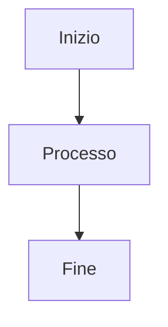

# Riferimento Markdown

Classic supporta la sintassi Markdown completa con anteprima in tempo reale. Ecco un riferimento completo per tutte le opzioni di formattazione supportate.

## Formattazione Base

| Sintassi | Risultato |
|----------|-----------|
| `**grassetto**` | **grassetto** |
| `*corsivo*` | *corsivo* |
| `~~barrato~~` | ~~barrato~~ |
| `# Intestazione 1` | Intestazione 1 |
| `## Intestazione 2` | ## Intestazione 2 |
| `### Intestazione 3` | ### Intestazione 3 |

## Link

```markdown
[Link inline](https://classic.app)

[Link stile riferimento][https://classic.app]
```

## Elenchi

```markdown
- Elemento 1
- Elemento 2
  - Elemento annidato 2a
    - Elemento annidato 2a
- Elemento 3

1. Primo elemento
2. Secondo elemento
3. Terzo elemento
```

## Blocchi di Codice

Codice inline:

```javascript
const greeting = "Hello, World!";
console.log(greeting);
```

Blocco di codice con linguaggio:

```python
def greet(name):
    return f"Hello, {name}!"

print(greet("Classic"))
```

## Citazioni

```markdown
> Questa è una citazione.
> Può contenere paragrafi multipli.
>
> — Qualcuno di famoso
```

## Linea Orizzontale

```markdown
---
```

## Tabelle

| Funzionalità | Stato |
|--------------|-------|
| Markdown | ✅ Supporto completo |
| Anteprima in Tempo Reale | ✅ Sì |
| Comandi Slash | ✅ Sì |

## Elenchi Attività

```markdown
- [x] Attività 1
- [ ] Attività 2
- [x] Attività 3
```

## Immagini

```markdown

```

## Note a Piè di Pagina

Ecco del testo con una nota a piè di pagina.[^1]

[^1]: Questa è la nota a piè di pagina.

## Caratteri di Escape

| Carattere | Escape | Risultato |
|-----------|--------|-----------|
| `<` | `&lt;` | `<` |
| `>` | `&gt;` | `>` |
| `&` | `&amp;` | `&` |

## Funzionalità Avanzate

### Diagrammi Mermaid

Crea diagrammi usando la sintassi Mermaid:



### Equazioni Matematiche

Usa KaTeX per espressioni matematiche:

```markdown
$$E = mc^2$$
```

Matematica inline: $E = mc^2$

### Evidenziazione Sintassi

Classic supporta l'evidenziazione della sintassi per oltre 100 linguaggi di programmazione.
