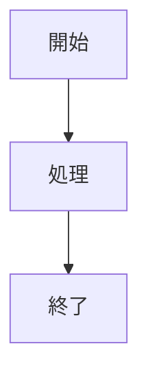
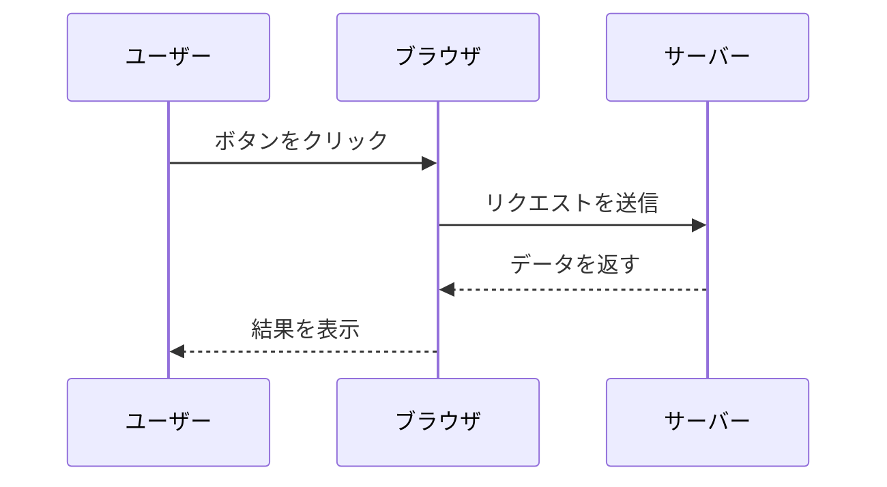
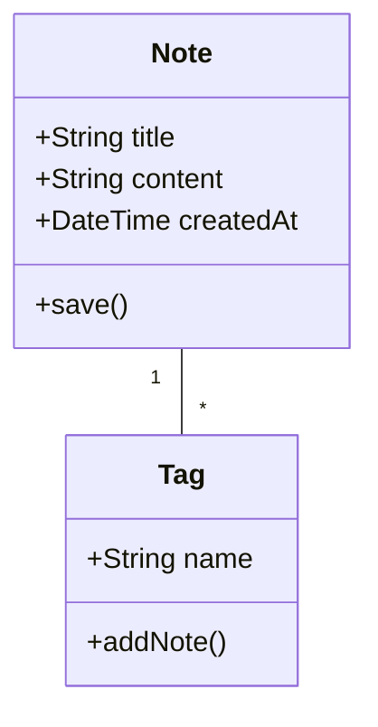
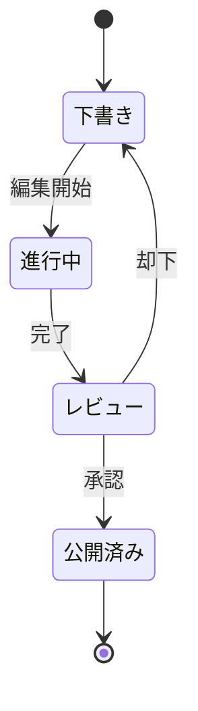
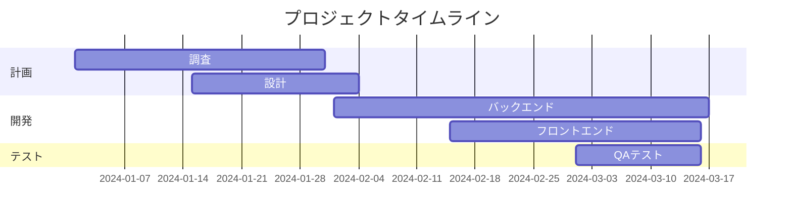
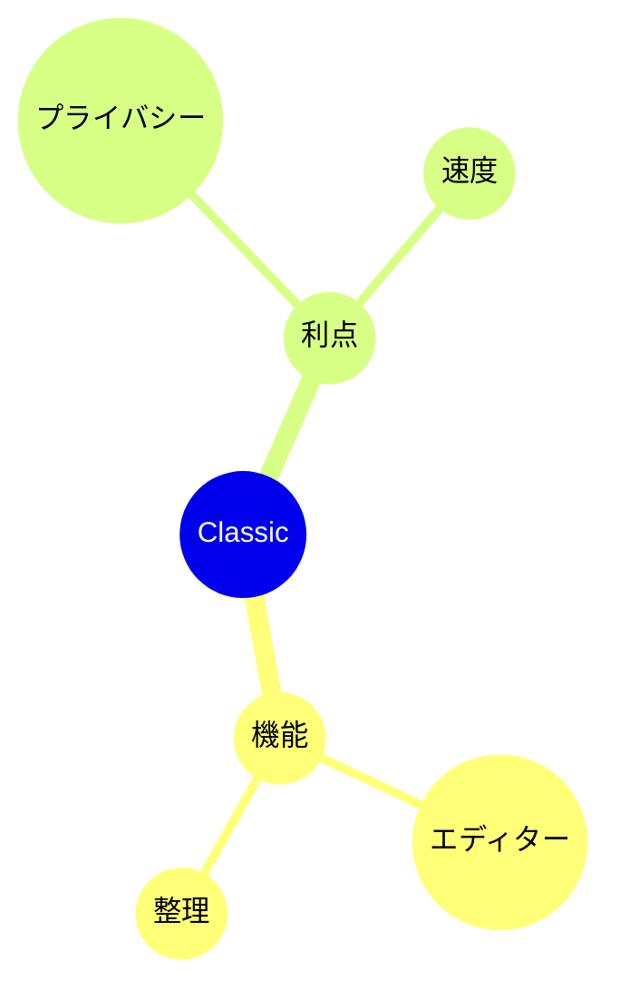

# Mermaidダイアグラム

Mermaid構文を使用してノート内に美しいダイアグラムを直接作成できます。

## 基本的な使い方

Mermaidダイアグラムを作成するには、`mermaid` 言語識別子でコードブロックを使用します:



## フローチャート

```mermaid
flowchart TD
    A[開始] --> B{動作していますか？}
    B -->|はい| C[素晴らしい！|
    B -->|いいえ| D[デバッグ]
    D --> B
```

## シーケンス図



## クラス図



## 状態図



## ガントチャート



## 円グラフ


## マインドマップ



## ヒント

### スタイリング

- サブグラフを使用して複雑なダイアグラムを整理
- 視覚的な一貫性のためにスタイルとテーマを追加
- ダイアグラムはシンプルで読みやすく保つ

### パフォーマンス

- 大きなダイアグラムはエディターを遅くする可能性
- 複雑なダイアグラムを小さなものに分割することを検討
- 設定に `%%{init: ... }%%` を使用

### よくある問題

**ダイアグラムがレンダリングされない？**
- Mermaid構文を確認
- コードブロックに `mermaid` 言語があることを確認
- プレビューで構文エラーを探す

**ダイアグラムが小さすぎる/大きすぎる？**
- `%%{init: {'theme': 'base', 'themeVariables': { 'fontSize': '16px' }}}%%` を使用してサイズを調整

## リソース

- [Mermaidドキュメント](https://mermaid.js.org/)
- [Mermaidライブエディター](https://mermaid.live/)
- [Mermaid GitHub](https://github.com/mermaid-js/mermaid)
