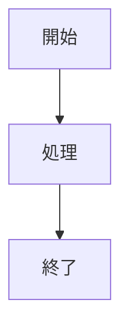

# Markdownリファレンス

Classicはライブプレビュー付きの完全なMarkdown構文をサポートしています。サポートされているすべてのフォーマットオプションの包括的なリファレンスです。

## 基本的なフォーマット

| 構文 | 結果 |
|-------|--------|
| `**太字**` | **太字** |
| `*斜体*` | *斜体* |
| `~~取り消し線~~` | ~~取り消し線~~ |
| `==見出し 1==` | 見出し 1 |
| `### 見出し 2` | ### 見出し 2 |
| `#### 見出し 3` | #### 見出し 3 |

## リンク

```markdown
[インラインリンク](https://classic.app)

[参照スタイルリンク][https://classic.app]
```

## リスト

```markdown
- 項目 1
- 項目 2
  - ネストされた項目 2a
    - ネストされた項目 2a
- 項目 3

1. 最初の項目
2. 2番目の項目
3. 3番目の項目
```

## コードブロック

インライン `コード`:

```javascript
const greeting = "Hello, World!";
console.log(greeting);
```

言語付きコードブロック:

```javascript
```python
def greet(name):
    return f"Hello, {name}!"

print(greet("Classic"))
```

## 引用

```markdown
> これは引用です。
> 複数の段落を含めることができます。
>
> — 誰かの名言
```

## 水平線

```markdown
---
```

## テーブル

| 機能 | ステータス |
| ------ | ------ |
| Markdown | ✅ 完全サポート |
| ライブプレビュー | ✅ あり |
| スラッシュコマンド | ✅ あり |

## タスクリスト

```markdown
- [x] タスク 1
- [ ] タスク 2
- [x] タスク 3
```

## 画像

```markdown

```

## 脚注

ここに脚注付きのテキストがあります。[^1]

[^1]: これが脚注です。
```

## 文字のエスケープ

| 文字 | エスケープ | 結果 |
|-----------|--------|--------|
| `<` | `&lt;` | `<` |
| `>` | `&gt;` | `>` |
| `&` | `&amp;` | `&` |

## 高度な機能

### Mermaidダイアグラム

Mermaid構文を使用してダイアグラムを作成:



### 数式

KaTeXを使用して数学的な表現:

```markdown
$$E = mc^2$$
```

インライン数式: $E = mc^2$

### シンタックスハイライト

Classicは100以上のプログラミング言語のシンタックスハイライトをサポートしています。
