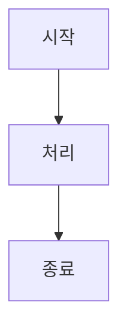
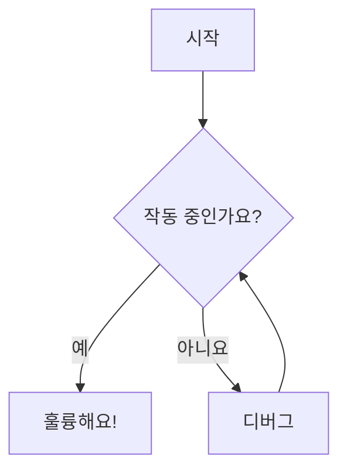
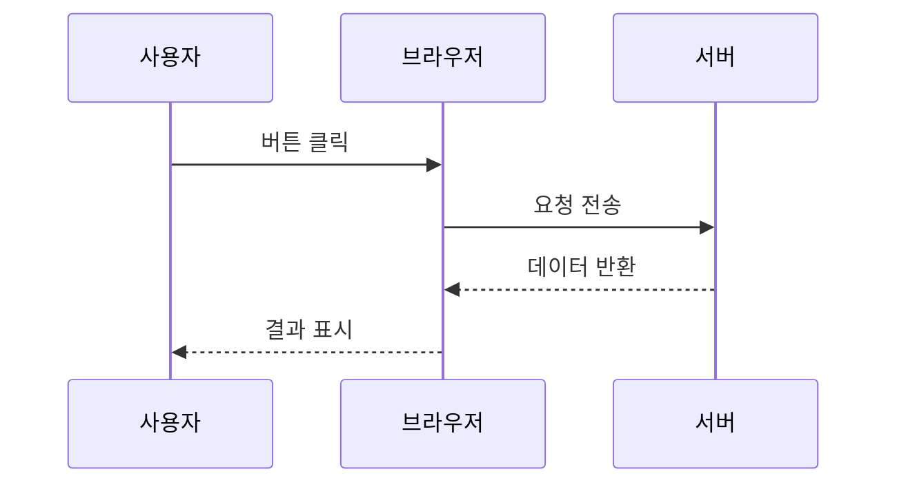
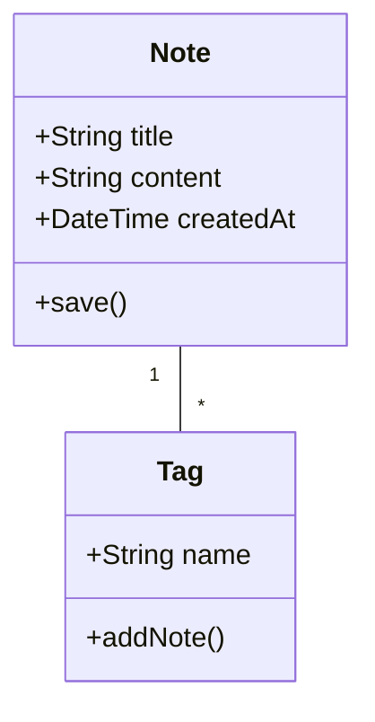
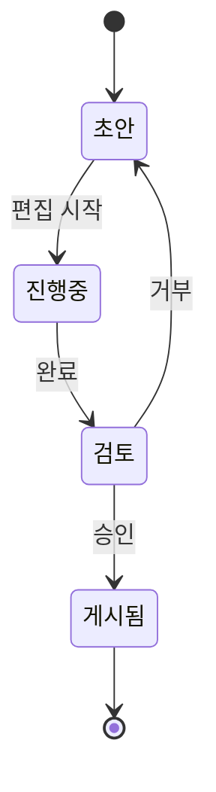
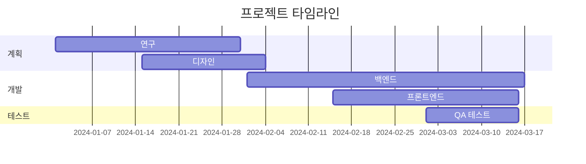
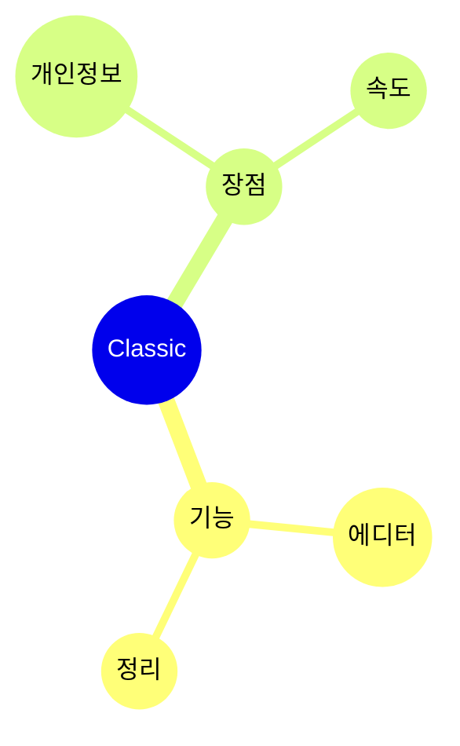

# Mermaid 다이어그램

Mermaid 구문을 사용하여 노트에서 직접 아름다운 다이어그램을 만드세요.

## 기본 사용법

Mermaid 다이어그램을 만들려면 `mermaid` 언어 식별자가 있는 코드 블록을 사용하세요:

## 순서도

## 시퀀스 다이어그램

## 클래스 다이어그램

## 상태 다이어그램

## 간트 차트

## 원형 차트

## 마인드맵

## 팁

### 스타일링

- 서브그래프를 사용하여 복잡한 다이어그램 정리
- 시각적 일관성을 위해 스타일 및 테마 추가
- 다이어그램을 단순하고 읽기 쉽게 유지

### 성능

- 큰 다이어그램은 에디터 속도를 늦출 수 있습니다
- 복잡한 다이어그램을 더 작은 것으로 나누는 것을 고려하세요
- 구성에 `%%{init: ... }%%` 사용

### 일반적인 문제

**다이어그램이 렌더링되지 않나요?**
- Mermaid 구문 확인
- 코드 블록에 `mermaid` 언어가 있는지 확인
- 미리보기에서 구문 오류 찾기

**다이어그램이 너무 작거나 크나요?**
- `%%{init: {'theme': 'base', 'themeVariables': { 'fontSize': '16px' }}}%%`를 사용하여 크기 조정

## 리소스

- [Mermaid 문서](https://mermaid.js.org/)
- [Mermaid 라이브 에디터](https://mermaid.live/)
- [Mermaid GitHub](https://github.com/mermaid-js/mermaid)
