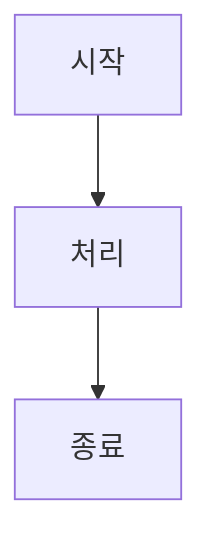

# Markdown 참조

Classic은 실시간 미리보기와 함께 전체 Markdown 구문을 지원합니다. 지원되는 모든 서식 옵션에 대한 포괄적인 참조입니다.

## 기본 서식

| 구문 | 결과 |
|-----|------|
| `**굵게**` | **굵게** |
| `*기울임꼴*` | *기울임꼴* |
| `~~취소선~~` | ~~취소선~~ |
| `# 제목 1` | 제목 1 |
| `## 제목 2` | ## 제목 2 |
| `### 제목 3` | ### 제목 3 |

## 링크

```markdown
[인라인 링크](https://classic.app)

[참조 스타일 링크][https://classic.app]
```

## 목록

```markdown
- 항목 1
- 항목 2
  - 중첩 항목 2a
    - 중첩 항목 2aa
- 항목 3

1. 첫 번째 항목
2. 두 번째 항목
3. 세 번째 항목
```

## 코드 블록

인라인 `코드`:

```javascript
const greeting = "Hello, World!";
console.log(greeting);
```

언어가 있는 코드 블록:

```python
def greet(name):
    return f"Hello, {name}!"

print(greet("Classic"))
```

## 인용문

```markdown
> 이것은 인용문입니다.
> 여러 단락을 포함할 수 있습니다.
>
> — 유명한 사람
```

## 수평선

```markdown
---
```

## 표

| 기능 | 상태 |
| ---- | ---- |
| Markdown | ✅ 전체 지원 |
| 실시간 미리보기 | ✅ 예 |
| 슬래시 명령 | ✅ 예 |

## 할 일 목록

```markdown
- [x] 작업 1
- [ ] 작업 2
- [x] 작업 3
```

## 이미지

```markdown

```

## 각주

각주가 있는 텍스트입니다.[^1]

[^1]: 이것은 각주입니다.
```

## 문자 이스케이프

| 문자 | 이스케이프 | 결과 |
|------|-----------|------|
| `<` | `&lt;` | `<` |
| `>` | `&gt;` | `>` |
| `&` | `&amp;` | `&` |

## 고급 기능

### Mermaid 다이어그램

Mermaid 구문을 사용하여 다이어그램 만들기:



### 수학 공식

KaTeX를 사용하여 수학 표현:

```markdown
$$E = mc^2$$
```

인라인 수학: $E = mc^2$

### 구문 강조

Classic은 100개 이상의 프로그래밍 언어에 대한 구문 강조를 지원합니다.
