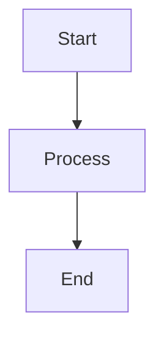

# Markdown Reference

Classic supports full Markdown syntax with live preview. Here's a comprehensive reference for all supported formatting options.

## Basic Formatting

| Syntax | Result |
|-------|--------|
| `**bold**` | **bold** |
| `*italic*` | *italic* |
| `~~strikethrough~~` | ~~strikethrough~~ |
| `==Heading 1==` | Heading 1 |
| `### Heading 2` | ### Heading 2 |
| `#### Heading 3` | #### Heading 3 |

## Links

```markdown
[Inline link](https://classic.app)

[Reference-style link][https://classic.app]
```

## Lists

```markdown
- Item 1
- Item 2
  - Nested item 2a
    - Nested item 2a
- Item 3

1. First item
2. Second item
3. Third item
```

## Code Blocks

Inline `code`:

```javascript
const greeting = "Hello, World!";
console.log(greeting);
```

Code block with language:

```javascript
```python
def greet(name):
    return f"Hello, {name}!"

print(greet("Classic"))
```

## Blockquotes

```markdown
> This is a blockquote.
> It> It can contain multiple paragraphs.
>
> — Someone famous
```

## Horizontal Rule

```markdown
---
```

## Tables

| Feature | Status |
| ------ | ------ |
| Markdown | ✅ Full support |
| Live Preview | ✅ Yes |
| Slash Commands | ✅ Yes |

## Task Lists

```markdown
- [x] Task 1
- [ ] Task 2
- [x] Task 3
```

## Images

```markdown

```

## Footnotes

Here is some text with a footnote.[^1]

[^1]: This is the footnote.
```

## Escaping Characters

| Character | Escape | Result |
|-----------|--------|--------|
| `<` | `&lt;` | `<` |
| `>` | `&gt;` | `>` |
| `&` | `&amp;` | `&` |

## Advanced Features

### Mermaid Diagrams

Create diagrams using Mermaid syntax:



### Math Equations

Use KaTeX for mathematical expressions:

```markdown
$$E = mc^2$$
```

Inline math: $E = mc^2$

### Syntax Highlighting

Classic supports syntax highlighting for over 100 programming languages.
