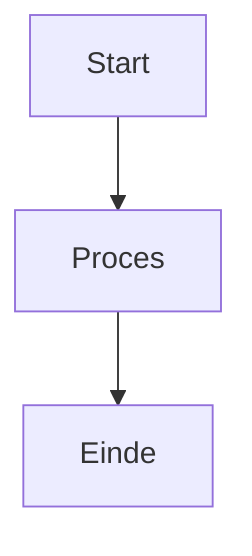
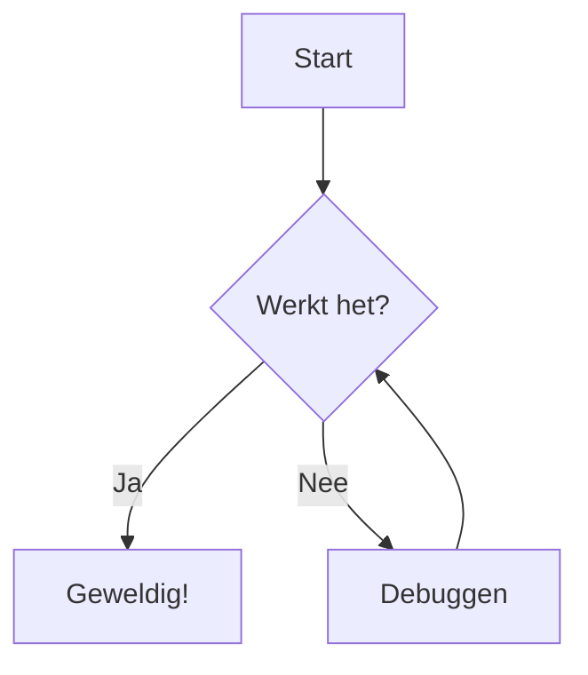
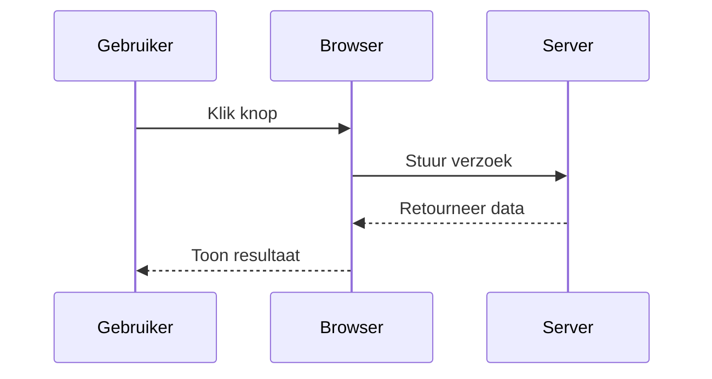
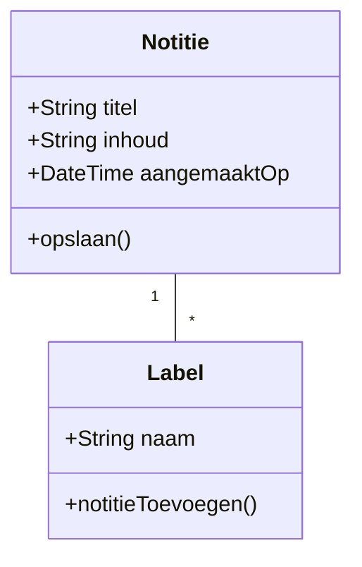
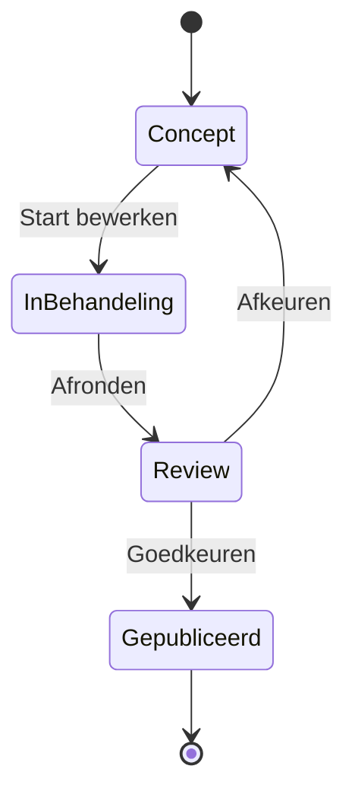
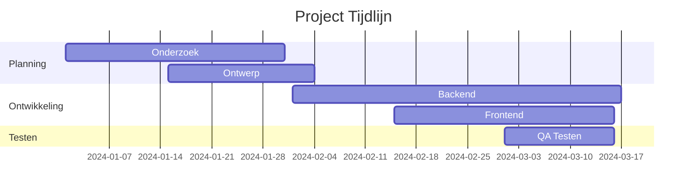
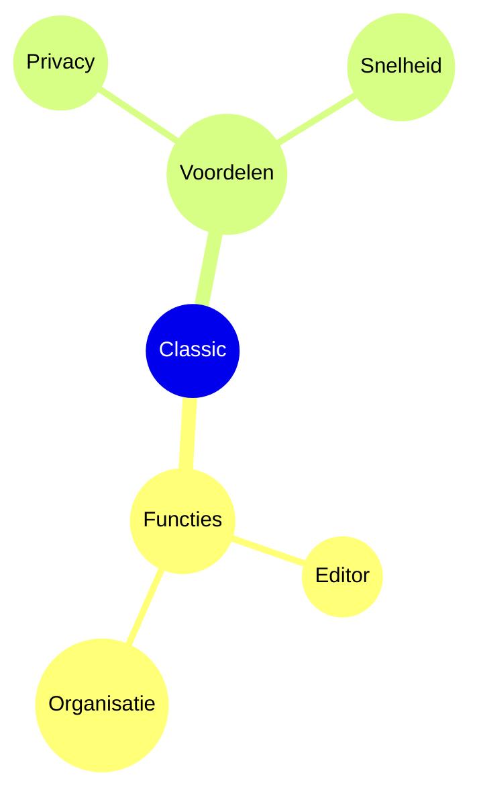

# Mermaid Diagrammen

Maak prachtige diagrammen direct in je notities met Mermaid-syntax.

## Basisgebruik

Om een Mermaid-diagram te maken, gebruik je een codeblok met de `mermaid` taalidentificatie:

## Stroomdiagram

## Sequentiediagram

## Klassediagram

## Toestandsdiagram

## Gantt Chart

## Cirkeldiagram

## Mindmap

## Tips

### Styling

- Gebruik subgraphs om complexe diagrammen te organiseren
- Voeg stijlen en thema's toe voor visuele consistentie
- Houd diagrammen eenvoudig en leesbaar

### Prestaties

- Grote diagrammen kunnen de editor vertragen
- Overweeg om complexe diagrammen op te splitsen in kleinere
- Gebruik `%%{init: ... }%%` voor configuratie

### Veelvoorkomende Problemen

**Diagram wordt niet gerenderd?**
- Controleer Mermaid-syntax
- Zorg dat het codeblok `mermaid` als taal heeft
- Zoek naar syntaxfouten in het voorbeeld

**Diagram te klein/groot?**
- Gebruik `%%{init: {'theme': 'base', 'themeVariables': { 'fontSize': '16px' }}}%%` om de grootte aan te passen

## Bronnen

- [Mermaid Documentatie](https://mermaid.js.org/)
- [Mermaid Live Editor](https://mermaid.live/)
- [Mermaid GitHub](https://github.com/mermaid-js/mermaid)
