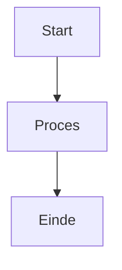

# Markdown Referentie

Classic ondersteunt volledige Markdown-syntax met live voorbeeld. Hier is een uitgebreide referentie voor alle ondersteunde opmaakopties.

## Basis Opmaak

| Syntax | Resultaat |
|-------|--------|
| `**vet**` | **vet** |
| `*cursief*` | *cursief* |
| `~~doorhalen~~` | ~~doorhalen~~ |
| `# Kop 1` | Kop 1 |
| `## Kop 2` | ## Kop 2 |
| `### Kop 3` | ### Kop 3 |

## Links

```markdown
[Inline link](https://classic.app)

[Referentie-stijl link][https://classic.app]
```

## Lijsten

```markdown
- Item 1
- Item 2
  - Genest item 2a
    - Genest item 2a
- Item 3

1. Eerste item
2. Tweede item
3. Derde item
```

## Codeblokken

Inline `code`:

```javascript
const greeting = "Hallo, Wereld!";
console.log(greeting);
```

Codeblok met taal:

```python
def greet(name):
    return f"Hallo, {name}!"

print(greet("Classic"))
```

## Blokcitaten

```markdown
> Dit is een blokcitaat.
> Het kan meerdere alinea's bevatten.
>
> — Iemand beroemds
```

## Horizontale Lijn

```markdown
---
```

## Tabellen

| Functie | Status |
| ------ | ------ |
| Markdown | ✅ Volledige ondersteuning |
| Live Voorbeeld | ✅ Ja |
| Slash-commando's | ✅ Ja |

## Takenlijsten

```markdown
- [x] Taak 1
- [ ] Taak 2
- [x] Taak 3
```

## Afbeeldingen

```markdown

```

## Voetnoten

Hier is wat tekst met een voetnoot.[^1]

[^1]: Dit is de voetnoot.

## Tekens Ongedaan Maken

| Teken | Escape | Resultaat |
|-----------|--------|--------|
| `<` | `&lt;` | `<` |
| `>` | `&gt;` | `>` |
| `&` | `&amp;` | `&` |

## Geavanceerde Functies

### Mermaid Diagrammen

Maak diagrammen met Mermaid-syntax:



### Wiskundevergelijkingen

Gebruik KaTeX voor wiskundige uitdrukkingen:

```markdown
$$E = mc^2$$
```

Inline wiskunde: $E = mc^2$

### Syntaxiskleuring

Classic ondersteunt syntaxiskleuring voor meer dan 100 programmeertalen.
