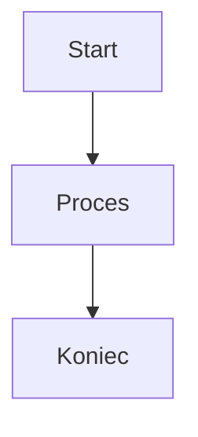
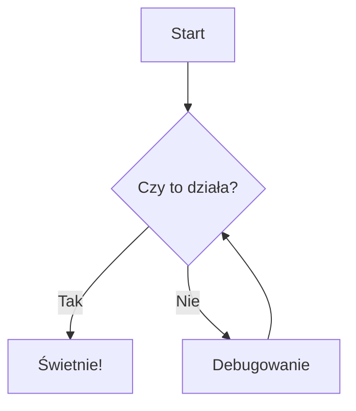
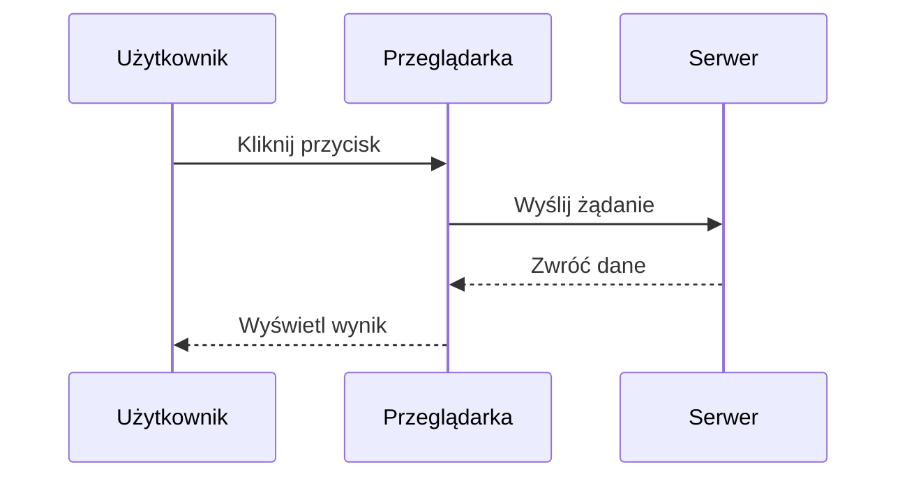
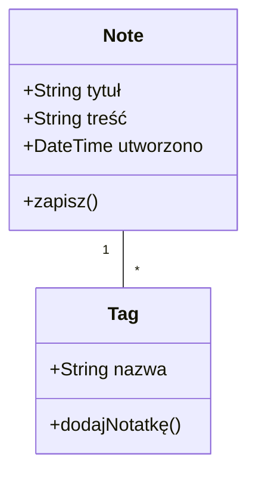
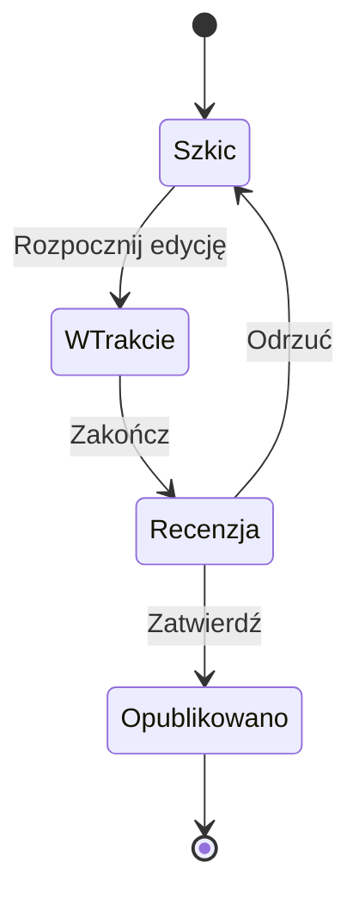
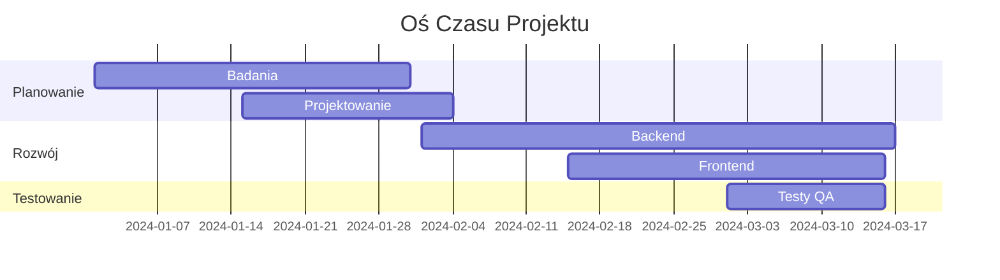
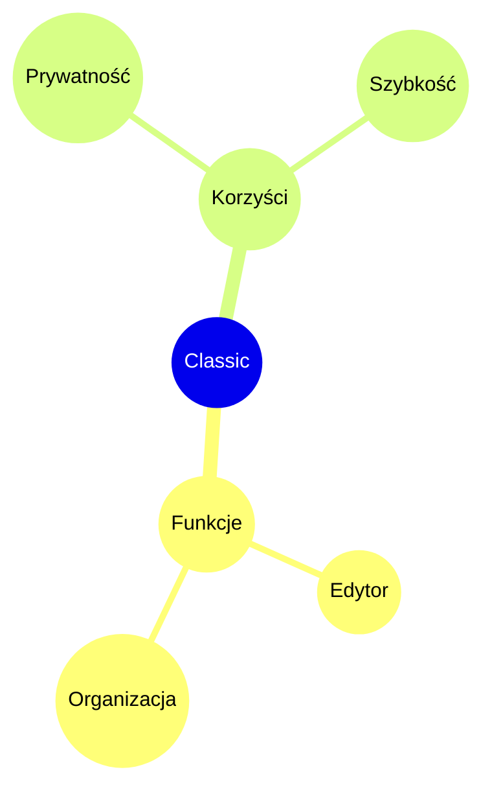

# Diagramy Mermaid

Twórz piękne diagramy bezpośrednio w swoich notatkach używając składni Mermaid.

## Podstawowe Użycie

Aby utworzyć diagram Mermaid, użyj bloku kodu z identyfikatorem języka `mermaid`:

## Schemat Blokowy

## Diagram Sekwencji

## Diagram Klas

## Diagram Stanów

## Wykres Gantta

## Wykres Kołowy

## Mapa Myśli

## Wskazówki

### Stylizacja

- Używaj podgrafów do organizowania złożonych diagramów
- Dodawaj style i motywy dla spójności wizualnej
- Utrzymuj diagramy proste i czytelne

### Wydajność

- Duże diagramy mogą spowolnić edytor
- Rozważ podzielenie złożonych diagramów na mniejsze
- Użyj `%%{init: ... }%%` dla konfiguracji

### Typowe Problemy

**Diagram się nie renderuje?**
- Sprawdź składnię Mermaid
- Upewnij się, że blok kodu ma język `mermaid`
- Szukaj błędów składni w podglądzie

**Diagram za mały/za duży?**
- Użyj `%%{init: {'theme': 'base', 'themeVariables': { 'fontSize': '16px' }}}%%` aby dostosować rozmiar

## Zasoby

- [Dokumentacja Mermaid](https://mermaid.js.org/)
- [Edytor Live Mermaid](https://mermaid.live/)
- [GitHub Mermaid](https://github.com/mermaid-js/mermaid)
