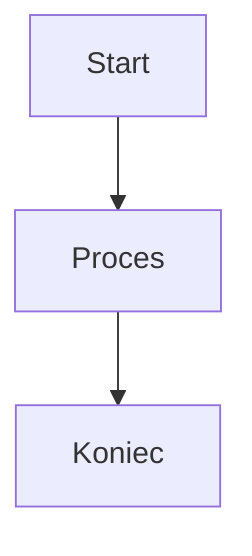

# Dokumentacja Markdown

Classic obsługuje pełną składnię Markdown z podglądem na żywo. Oto kompleksowa dokumentacja wszystkich obsługiwanych opcji formatowania.

## Podstawowe Formatowanie

| Składnia | Wynik |
|-------|--------|
| `**pogrubienie**` | **pogrubienie** |
| `*kursywa*` | *kursywa* |
| `~~przekreślenie~~` | ~~przekreślenie~~ |
| `# Nagłówek 1` | Nagłówek 1 |
| `## Nagłówek 2` | ## Nagłówek 2 |
| `### Nagłówek 3` | ### Nagłówek 3 |

## Linki

```markdown
[Link w linii](https://classic.app)

[Link w stylu referencyjnym][https://classic.app]
```

## Listy

```markdown
- Element 1
- Element 2
  - Zagnieżdżony element 2a
    - Zagnieżdżony element 2a
- Element 3

1. Pierwszy element
2. Drugi element
3. Trzeci element
```

## Bloki Kodu

Kod w linii `code`:

```javascript
const greeting = "Witaj, Świecie!";
console.log(greeting);
```

Blok kodu z językiem:

```python
def greet(name):
    return f"Witaj, {name}!"

print(greet("Classic"))
```

## Cytaty Blokowe

```markdown
> To jest cytat blokowy.
> Może zawierać wiele akapitów.
>
> — Ktoś sławny
```

## Pozioma Linia

```markdown
---
```

## Tabele

| Funkcja | Status |
| ------ | ------ |
| Markdown | ✅ Pełna obsługa |
| Podgląd na Żywo | ✅ Tak |
| Polecenia Ukośnikowe | ✅ Tak |

## Listy Zadań

```markdown
- [x] Zadanie 1
- [ ] Zadanie 2
- [x] Zadanie 3
```

## Obrazy

```markdown

```

## Przypisy

Oto tekst z przypisem.[^1]

[^1]: To jest przypis.
```

## Znaków Ucieczki

| Znak | Ucieczka | Wynik |
|-----------|--------|--------|
| `<` | `&lt;` | `<` |
| `>` | `&gt;` | `>` |
| `&` | `&amp;` | `&` |

## Zaawansowane Funkcje

### Diagramy Mermaid

Twórz diagramy używając składni Mermaid:



### Równania Matematyczne

Użyj KaTeX dla wyrażeń matematycznych:

```markdown
$$E = mc^2$$
```

Matematyka w linii: $E = mc^2$

### Podświetlanie Składni

Classic obsługuje podświetlanie składni dla ponad 100 języków programowania.
