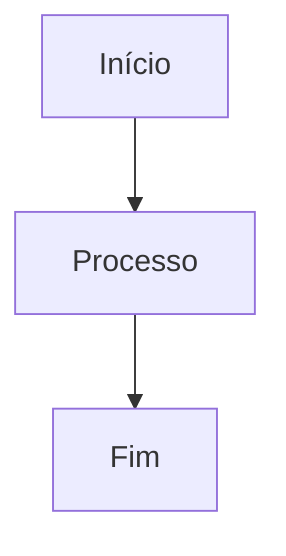
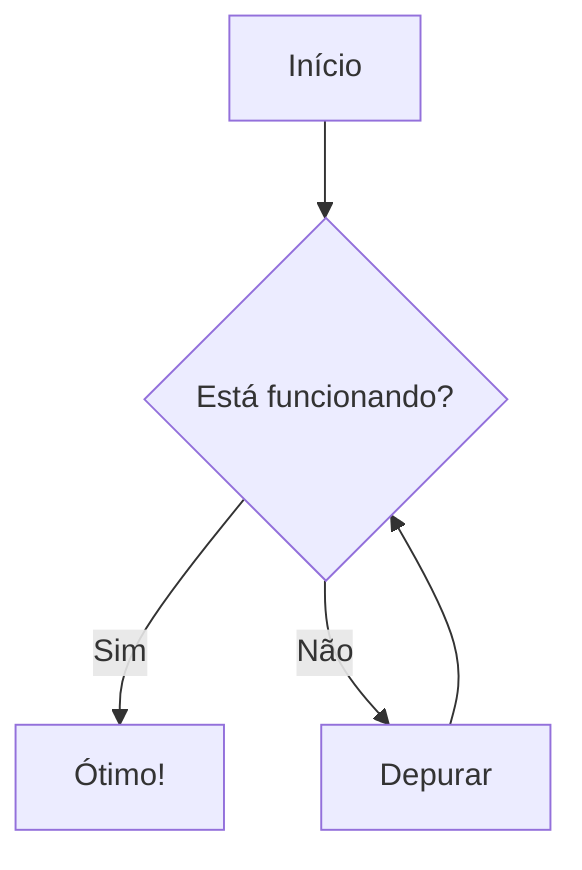
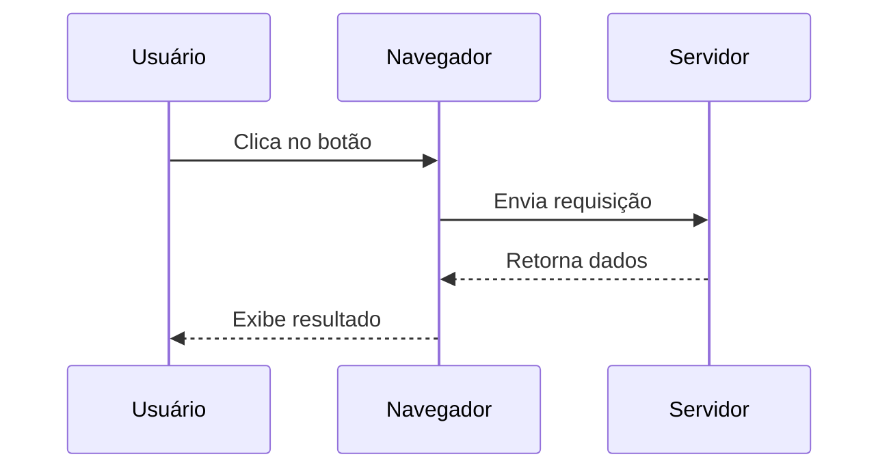
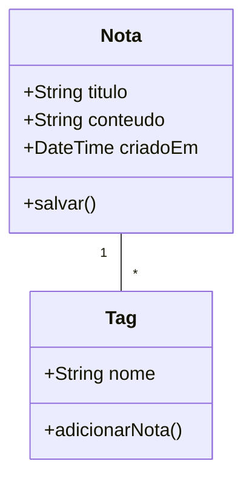
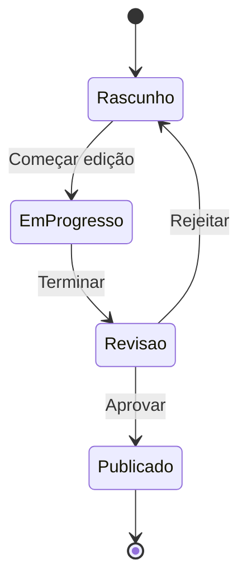
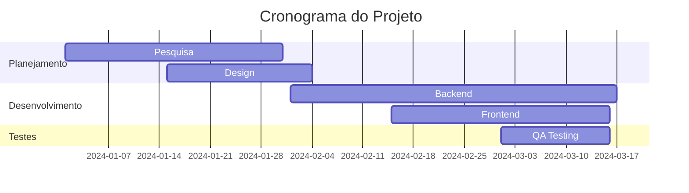
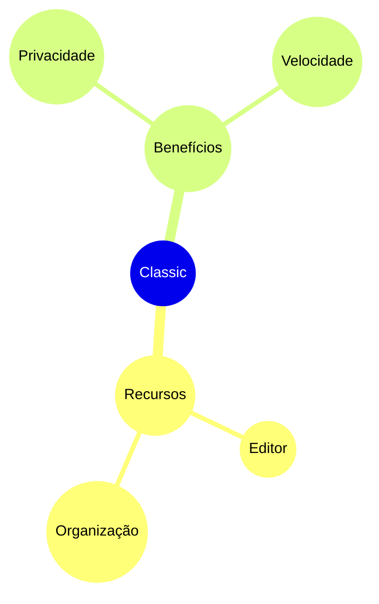

# Diagramas Mermaid

Crie diagramas bonitos diretamente em suas notas usando a sintaxe Mermaid.

## Uso Básico

Para criar um diagrama Mermaid, use um bloco de código com o identificador de linguagem `mermaid`:

## Fluxograma

## Diagrama de Sequência

## Diagrama de Classes

## Diagrama de Estados

## Gráfico de Gantt

## Gráfico de Pizza

## Mapa Mental

## Dicas

### Estilização

- Use subgrafos para organizar diagramas complexos
- Adicione estilos e temas para consistência visual
- Mantenha os diagramas simples e legíveis

### Performance

- Diagramas grandes podem deixar o editor lento
- Considere dividir diagramas complexos em menores
- Use `%%{init: ... }%%` para configuração

### Problemas Comuns

**Diagrama não está renderizando?**
- Verifique a sintaxe Mermaid
- Certifique-se de que o bloco de código tem a linguagem `mermaid`
- Procure erros de sintaxe na visualização

**Diagrama muito pequeno/grande?**
- Use `%%{init: {'theme': 'base', 'themeVariables': { 'fontSize': '16px' }}}%%` para ajustar o tamanho

## Recursos

- [Documentação Mermaid](https://mermaid.js.org/)
- [Editor Mermaid Live](https://mermaid.live/)
- [Mermaid GitHub](https://github.com/mermaid-js/mermaid)
