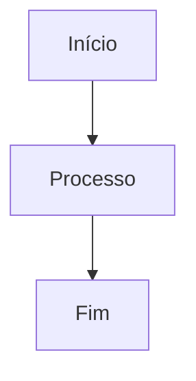

# Referência Markdown

O Classic suporta a sintaxe Markdown completa com visualização em tempo real. Aqui está uma referência abrangente de todas as opções de formatação suportadas.

## Formatação Básica

| Sintaxe | Resultado |
|---------|-----------|
| `**negrito**` | **negrito** |
| `*itálico*` | *itálico* |
| `~~tachado~~` | ~~tachado~~ |
| `# Título 1` | Título 1 |
| `## Título 2` | ## Título 2 |
| `### Título 3` | ### Título 3 |

## Links

```markdown
[Link inline](https://classic.app)

[Link estilo referência][https://classic.app]
```

## Listas

```markdown
- Item 1
- Item 2
  - Item aninhado 2a
    - Item aninhado 2a
- Item 3

1. Primeiro item
2. Segundo item
3. Terceiro item
```

## Blocos de Código

Código inline `código`:

```javascript
const saudacao = "Olá, Mundo!";
console.log(saudacao);
```

Bloco de código com linguagem:

```python
def saudar(nome):
    return f"Olá, {nome}!"

print(saudar("Classic"))
```

## Citações

```markdown
> Esta é uma citação.
> Ela pode conter múltiplos parágrafos.
>
> — Alguém famoso
```

## Linha Horizontal

```markdown
---
```

## Tabelas

| Recurso | Status |
| ------- | ------ |
| Markdown | ✅ Suporte completo |
| Visualização em Tempo Real | ✅ Sim |
| Comandos com Barra | ✅ Sim |

## Listas de Tarefas

```markdown
- [x] Tarefa 1
- [ ] Tarefa 2
- [x] Tarefa 3
```

## Imagens

```markdown

```

## Notas de Rodapé

Aqui está algum texto com uma nota de rodapé.[^1]

[^1]: Esta é a nota de rodapé.

## Caracteres de Escape

| Caractere | Escape | Resultado |
|-----------|--------|-----------|
| `<` | `&lt;` | `<` |
| `>` | `&gt;` | `>` |
| `&` | `&amp;` | `&` |

## Recursos Avançados

### Diagramas Mermaid

Crie diagramas usando a sintaxe Mermaid:



### Equações Matemáticas

Use KaTeX para expressões matemáticas:

```markdown
$$E = mc^2$$
```

Matemática inline: $E = mc^2$

### Destaque de Sintaxe

O Classic suporta destaque de sintaxe para mais de 100 linguagens de programação.
