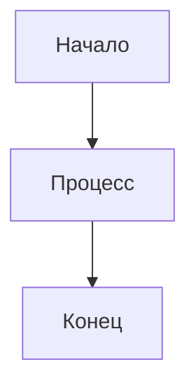
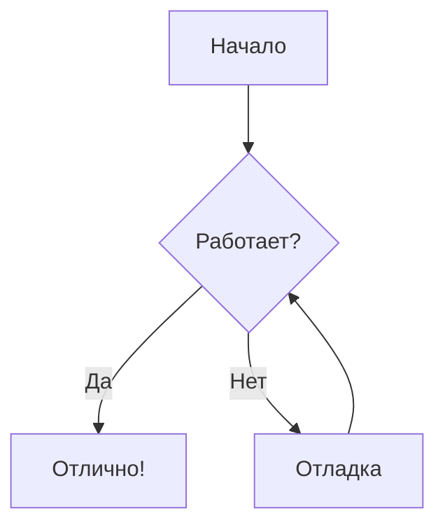
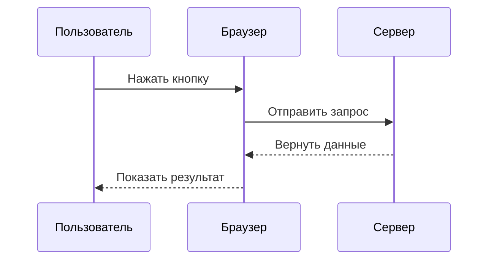
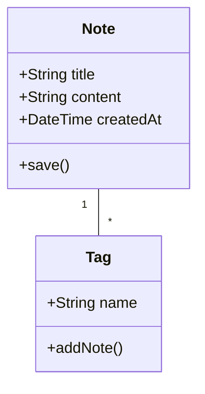
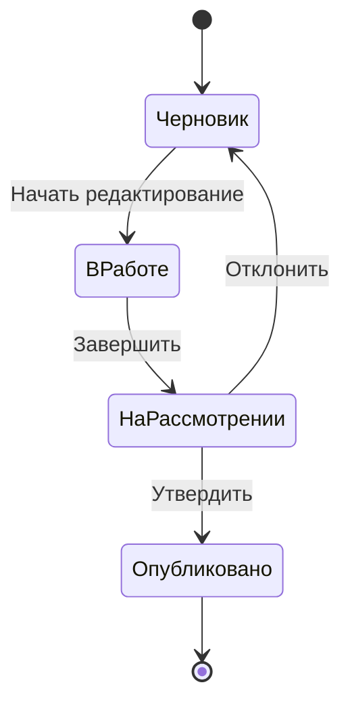
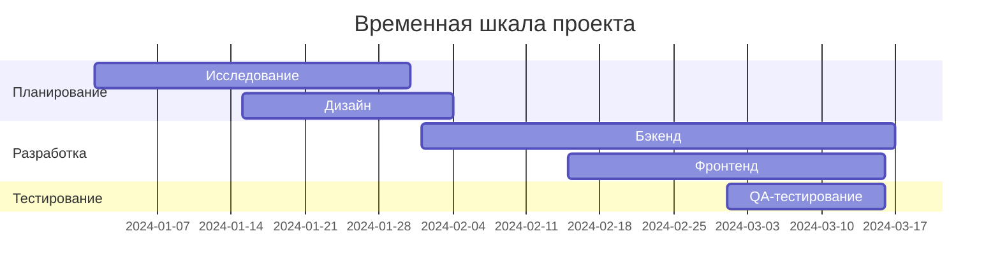
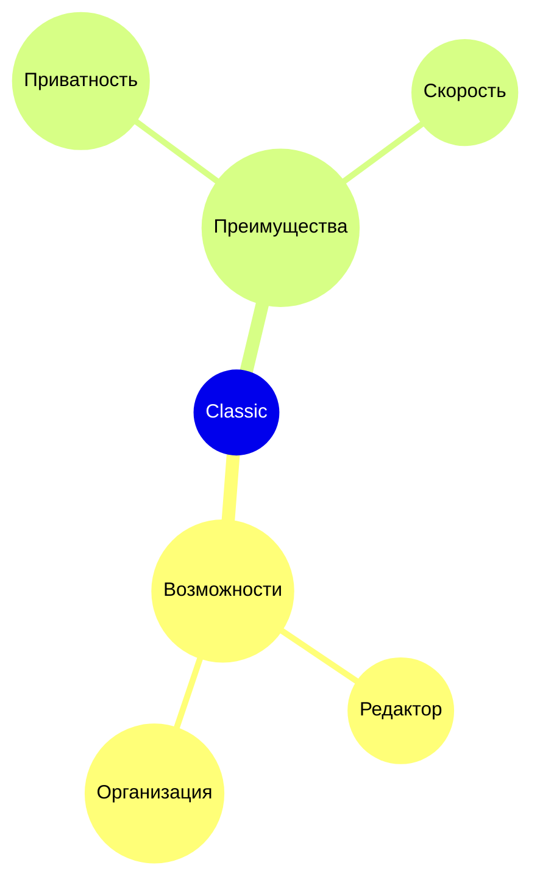

# Диаграммы Mermaid

Создавайте красивые диаграммы прямо в заметках с помощью синтаксиса Mermaid.

## Базовое использование

Для создания диаграммы Mermaid используйте блок кода с идентификатором языка `mermaid`:

## Блок-схема

## Диаграмма последовательности

## Диаграмма классов

## Диаграмма состояний

## Диаграмма Ганта

## Круговая диаграмма

## Ментальная карта

## Советы

### Стилизация

- Используйте подграфы для организации сложных диаграмм
- Добавляйте стили и темы для визуальной согласованности
- Держите диаграммы простыми и читаемыми

### Производительность

- Большие диаграммы могут замедлять редактор
- Рассмотрите разделение сложных диаграмм на меньшие
- Используйте `%%{init: ... }%%` для конфигурации

### Распространённые проблемы

**Диаграмма не отображается?**
- Проверьте синтаксис Mermaid
- Убедитесь, что блок кода имеет язык `mermaid`
- Ищите синтаксические ошибки в предпросмотре

**Диаграмма слишком маленькая/большая?**
- Используйте `%%{init: {'theme': 'base', 'themeVariables': { 'fontSize': '16px' }}}%%` для настройки размера

## Ресурсы

- [Документация Mermaid](https://mermaid.js.org/)
- [Редактор Mermaid Live](https://mermaid.live/)
- [GitHub Mermaid](https://github.com/mermaid-js/mermaid)
