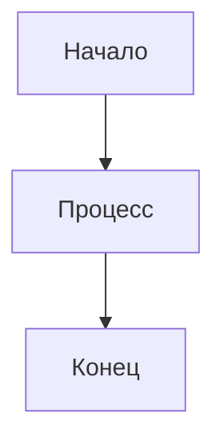

# Справочник по Markdown

Classic поддерживает полный синтаксис Markdown с живым предпросмотром. Вот полный справочник по всем поддерживаемым параметрам форматирования.

## Базовое форматирование

| Синтаксис | Результат |
|-------|--------|
| `**жирный**` | **жирный** |
| `*курсив*` | *курсив* |
| `~~зачёркнутый~~` | ~~зачёркнутый~~ |
| `# Заголовок 1` | Заголовок 1 |
| `## Заголовок 2` | ## Заголовок 2 |
| `### Заголовок 3` | ### Заголовок 3 |

## Ссылки

```markdown
[Встроенная ссылка](https://classic.app)

[Ссылка в справочном стиле][https://classic.app]
```

## Списки

```markdown
- Пункт 1
- Пункт 2
  - Вложенный пункт 2a
    - Вложенный пункт 2a
- Пункт 3

1. Первый пункт
2. Второй пункт
3. Третий пункт
```

## Блоки кода

Встроенный `код`:

```javascript
const greeting = "Привет, мир!";
console.log(greeting);
```

Блок кода с языком:

```python
def greet(name):
    return f"Привет, {name}!"

print(greet("Classic"))
```

## Цитаты

```markdown
> Это цитата.
> Она может содержать несколько абзацев.
>
> — Кто-то знаменитый
```

## Горизонтальная линия

```markdown
---
```

## Таблицы

| Возможность | Статус |
| ------ | ------ |
| Markdown | ✅ Полная поддержка |
| Живой предпросмотр | ✅ Да |
| Команды с косой чертой | ✅ Да |

## Списки задач

```markdown
- [x] Задача 1
- [ ] Задача 2
- [x] Задача 3
```

## Изображения

```markdown

```

## Сноски

Вот текст со сноской.[^1]

[^1]: Это сноска.
```

## Экранирование символов

| Символ | Экранирование | Результат |
|-----------|--------|--------|
| `<` | `&lt;` | `<` |
| `>` | `&gt;` | `>` |
| `&` | `&amp;` | `&` |

## Расширенные возможности

### Диаграммы Mermaid

Создавайте диаграммы с помощью синтаксиса Mermaid:



### Математические уравнения

Используйте KaTeX для математических выражений:

```markdown
$$E = mc^2$$
```

Встроенная математика: $E = mc^2$

### Подсветка синтаксиса

Classic поддерживает подсветку синтаксиса для более чем 100 языков программирования.
