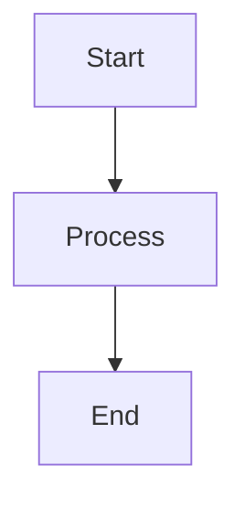
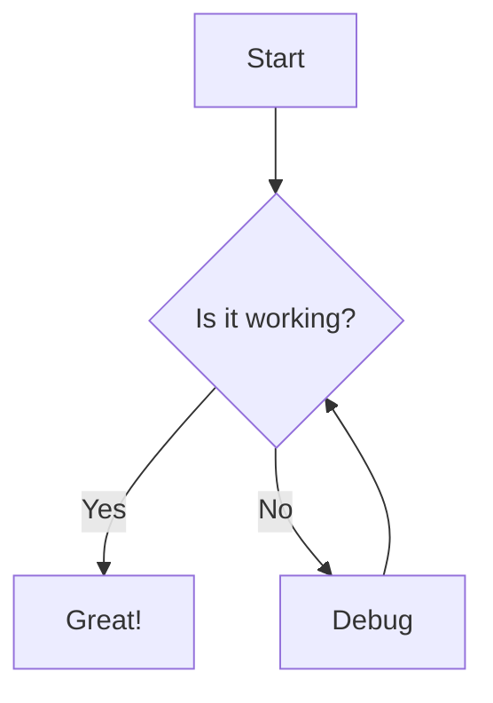
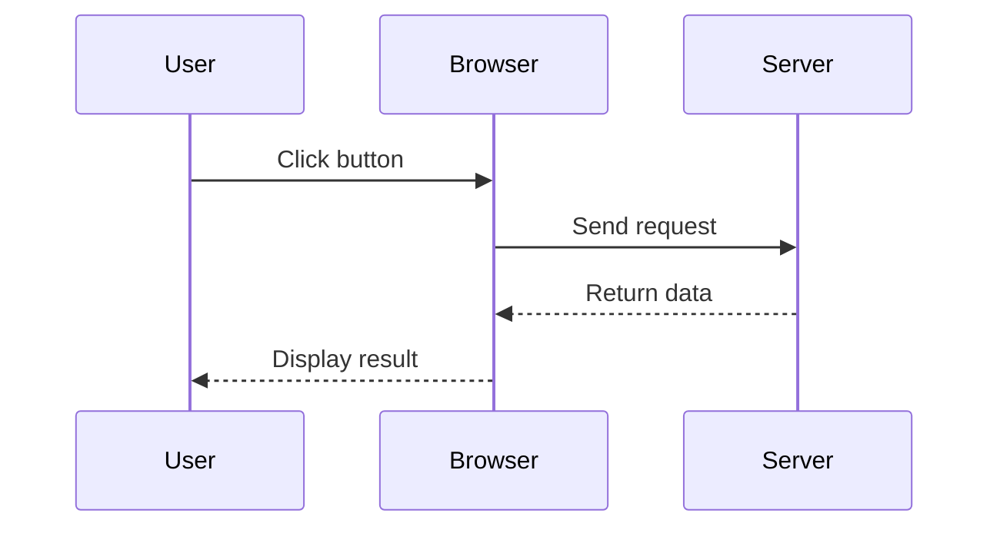
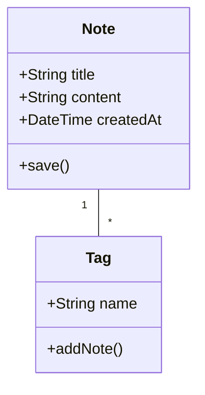
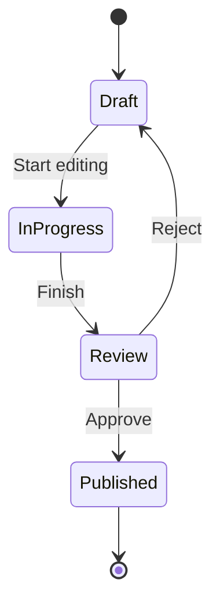
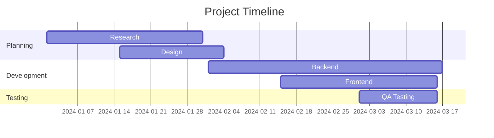
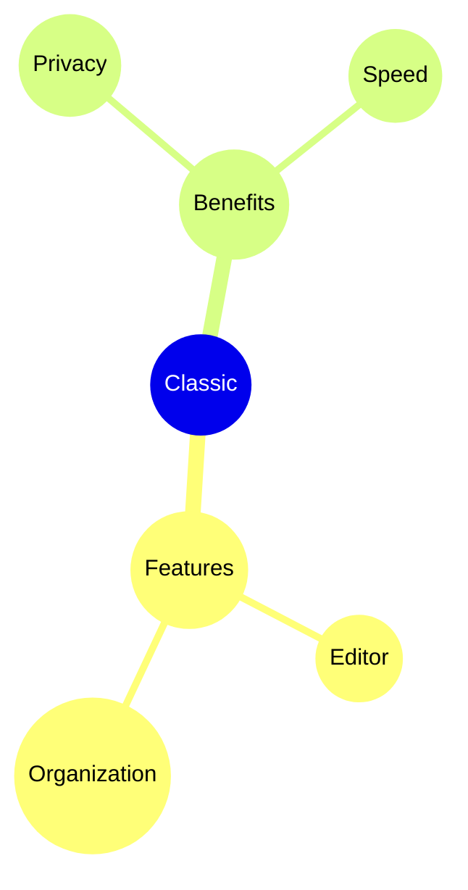

# ไดอะแกรม Mermaid

สร้างไดอะแกรมสวยงามโดยตรงในบันทึกของคุณโดยใช้ไวยากรณ์ Mermaid

## การใช้งานพื้นฐาน

เพื่อสร้างไดอะแกรม Mermaid ให้ใช้บล็อกโค้ดพร้อมตัวระบุภาษา `mermaid`:

## โฟลว์ชาร์ต

## ไดอะแกรมลำดับ

## ไดอะแกรมคลาส

## ไดอะแกรมสถานะ

## แผนภูมิแกนต์

## แผนภูมิวงกลม

## แผนที่ความคิด

## เคล็ดลับ

### การจัดสไตล์

- ใช้ subgraphs เพื่อจัดระเบียบไดอะแกรมที่ซับซ้อน
- เพิ่มสไตล์และธีมเพื่อความสอดคล้องของภาพ
- รักษาไดอะแกรมให้เรียบง่ายและอ่านง่าย

### ประสิทธิภาพ

- ไดอะแกรมขนาดใหญ่อาจทำให้ตัวแก้ไขช้าลง
- พิจารณาแบ่งไดอะแกรมที่ซับซ้อนเป็นไดอะแกรมเล็กๆ
- ใช้ `%%{init: ... }%%` สำหรับการกำหนดค่า

### ปัญหาทั่วไป

**ไดอะแกรมไม่แสดงผล?**
- ตรวจสอบไวยากรณ์ Mermaid
- ตรวจสอบให้แน่ใจว่าบล็อกโค้ดมีภาษา `mermaid`
- มองหาข้อผิดพลาดทางไวยากรณ์ในตัวอย่าง

**ไดอะแกรมเล็ก/ใหญ่เกินไป?**
- ใช้ `%%{init: {'theme': 'base', 'themeVariables': { 'fontSize': '16px' }}}%%` เพื่อปรับขนาด

## แหล่งข้อมูล

- [เอกสาร Mermaid](https://mermaid.js.org/)
- [Mermaid Live Editor](https://mermaid.live/)
- [Mermaid GitHub](https://github.com/mermaid-js/mermaid)
