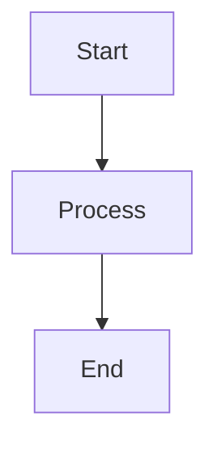

# อ้างอิง Markdown

Classic รองรับไวยากรณ์ Markdown เต็มรูปแบบพร้อมการแสดงตัวอย่างสด นี่คือข้อมูลอ้างอิงที่ครอบคลุมสำหรับตัวเลือกการจัดรูปแบบทั้งหมดที่รองรับ

## การจัดรูปแบบพื้นฐาน

| ไวยากรณ์ | ผลลัพธ์ |
|-------|--------|
| `**bold**` | **bold** |
| `*italic*` | *italic* |
| `~~strikethrough~~` | ~~strikethrough~~ |
| `# Heading 1` | Heading 1 |
| `## Heading 2` | ## Heading 2 |
| `### Heading 3` | ### Heading 3 |

## ลิงก์

```markdown
[Inline link](https://classic.app)

[Reference-style link][https://classic.app]
```

## รายการ

```markdown
- Item 1
- Item 2
  - Nested item 2a
    - Nested item 2a-1
- Item 3

1. First item
2. Second item
3. Third item
```

## บล็อกโค้ด

อินไลน์ `code`:

```javascript
const greeting = "Hello, World!";
console.log(greeting);
```

บล็อกโค้ดพร้อมภาษา:

```python
def greet(name):
    return f"Hello, {name}!"

print(greet("Classic"))
```

## บล็อกคำพูด

```markdown
> This is a blockquote.
> It can contain multiple paragraphs.
>
> — Someone famous
```

## เส้นคั่นแนวนอน

```markdown
---
```

## ตาราง

| คุณสมบัติ | สถานะ |
| ------ | ------ |
| Markdown | ✅ รองรับเต็มรูปแบบ |
| Live Preview | ✅ ใช่ |
| Slash Commands | ✅ ใช่ |

## รายการงาน

```markdown
- [x] Task 1
- [ ] Task 2
- [x] Task 3
```

## รูปภาพ

```markdown

```

## เชิงอรรถ

```markdown
Here is some text with a footnote.[^1]

[^1]: This is the footnote.
```

## การหลีกเลี่ยงอักขระ

| อักขระ | การหลีกเลี่ยง | ผลลัพธ์ |
|-----------|--------|--------|
| `<` | `&lt;` | `<` |
| `>` | `&gt;` | `>` |
| `&` | `&amp;` | `&` |

## คุณสมบัติขั้นสูง

### ไดอะแกรม Mermaid

สร้างไดอะแกรมโดยใช้ไวยากรณ์ Mermaid:



### สมการคณิตศาสตร์

ใช้ KaTeX สำหรับนิพจน์ทางคณิตศาสตร์:

```markdown
$$E = mc^2$$
```

อินไลน์แมธ: $E = mc^2$

### การเน้นไวยากรณ์

Classic รองรับการเน้นไวยากรณ์สำหรับภาษาโปรแกรมมากกว่า 100 ภาษา
