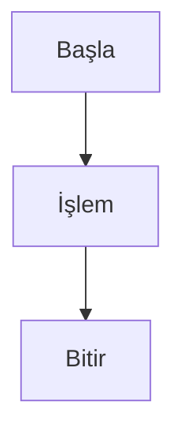
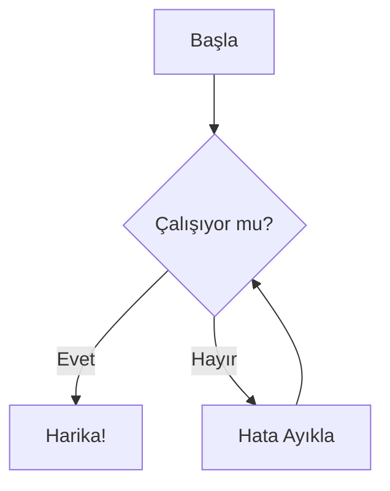
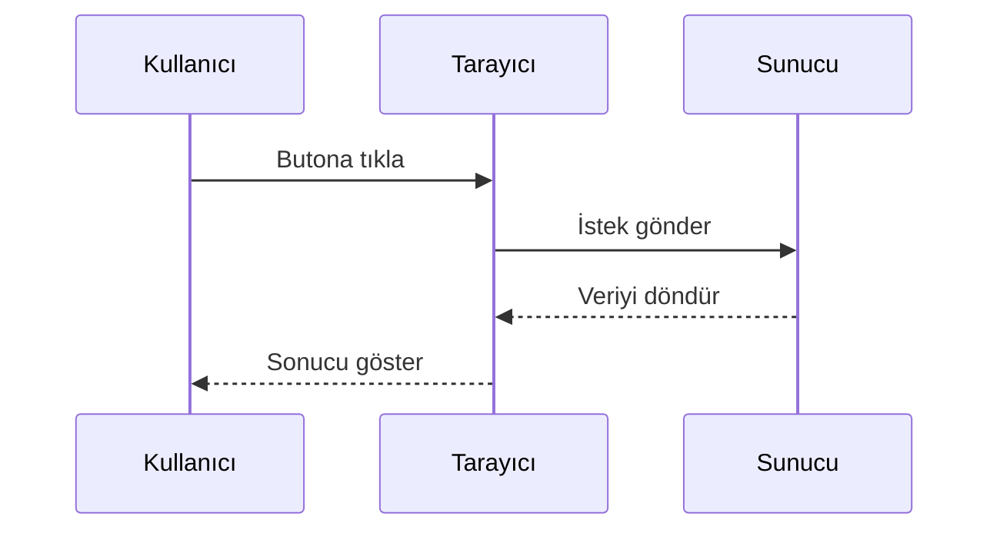
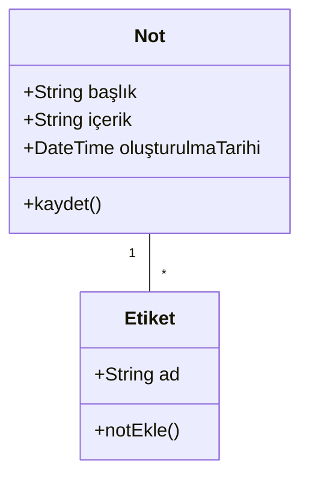
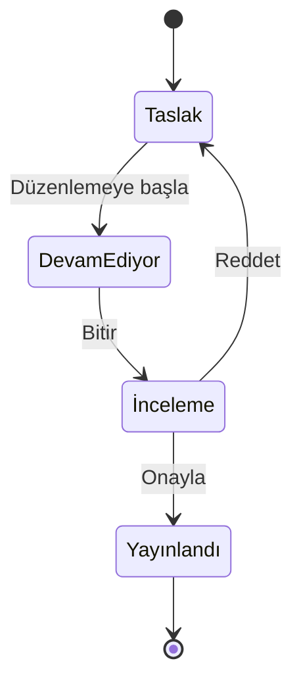
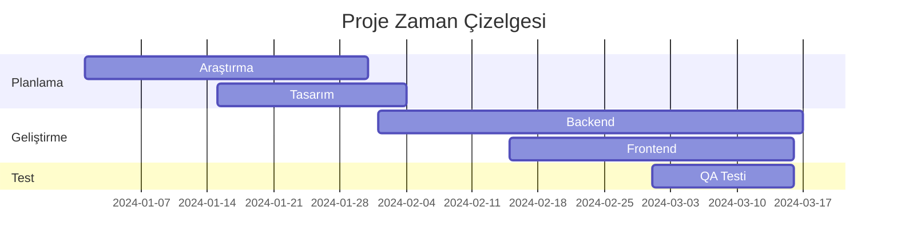
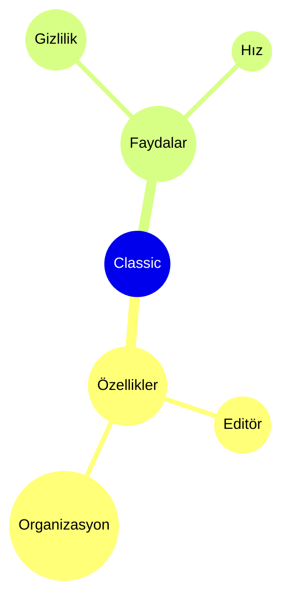

# Mermaid Diyagramları

Mermaid sözdizimini kullanarak notlarınızda doğrudan güzel diyagramlar oluşturun.

## Temel Kullanım

Mermaid diyagramı oluşturmak için `mermaid` dil tanımlayıcılı bir kod bloğu kullanın:

## Akış Şeması

## Sıra Diyagramı

## Sınıf Diyagramı

## Durum Diyagramı

## Gantt Şeması

## Pasta Grafik

## Zihin Haritası

## İpuçları

### Stil

- Karmaşık diyagramları düzenlemek için alt grafikleri kullanın
- Görsel tutarlılık için stiller ve temalar ekleyin
- Diyagramları basit ve okunabilir tutun

### Performans

- Büyük diyagramlar editörü yavaşlatabilir
- Karmaşık diyagramları daha küçük olanlara bölmeyi düşünün
- Yapılandırma için `%%{init: ... }%%` kullanın

### Yaygın Sorunlar

**Diyagram işlenmiyor mu?**
- Mermaid sözdizimini kontrol edin
- Kod bloğunun `mermaid` diline sahip olduğundan emin olun
- Önizlemede sözdizimi hatalarını arayın

**Diyagram çok küçük/büyük mü?**
- Boyutu ayarlamak için `%%{init: {'theme': 'base', 'themeVariables': { 'fontSize': '16px' }}}%%` kullanın

## Kaynaklar

- [Mermaid Dokümantasyonu](https://mermaid.js.org/)
- [Mermaid Canlı Editör](https://mermaid.live/)
- [Mermaid GitHub](https://github.com/mermaid-js/mermaid)
