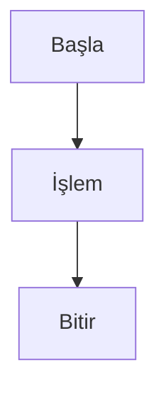

# Markdown Referansı

Classic, canlı önizleme ile tam Markdown sözdizimini destekler. İşte desteklenen tüm biçimlendirme seçenekleri için kapsamlı bir referans.

## Temel Biçimlendirme

| Sözdizimi | Sonuç |
|-----------|-------|
| `**kalın**` | **kalın** |
| `*eğik*` | *eğik* |
| `~~üstü çizili~~` | ~~üstü çizili~~ |
| `==Başlık 1==` | Başlık 1 |
| `### Başlık 2` | ### Başlık 2 |
| `#### Başlık 3` | #### Başlık 3 |

## Bağlantılar

```markdown
[Satır içi bağlantı](https://classic.app)

[Referans tarzı bağlantı][https://classic.app]
```

## Listeler

```markdown
- Öğe 1
- Öğe 2
  - İç içe öğe 2a
    - İç içe öğe 2a
- Öğe 3

1. İlk öğe
2. İkinci öğe
3. Üçüncü öğe
```

## Kod Blokları

Satır içi `kod`:

```javascript
const greeting = "Merhaba, Dünya!";
console.log(greeting);
```

Dil ile kod bloğu:

```javascript
```python
def greet(name):
    return f"Merhaba, {name}!"

print(greet("Classic"))
```

## Alıntı Blokları

```markdown
> Bu bir alıntı bloğudur.
> Birden fazla paragraf içerebilir.
>
> — Ünlü bir kişi
```

## Yatay Çizgi

```markdown
---
```

## Tablolar

| Özellik | Durum |
| ------- | ----- |
| Markdown | ✅ Tam destek |
| Canlı Önizleme | ✅ Evet |
| Bölü Komutları | ✅ Evet |

## Görev Listeleri

```markdown
- [x] Görev 1
- [ ] Görev 2
- [x] Görev 3
```

## Resimler

```markdown

```

## Dipnotlar

İşte dipnotlu bazı metinler.[^1]

[^1]: Bu dipnottur.
```

## Kaçış Karakterleri

| Karakter | Kaçış | Sonuç |
|----------|-------|-------|
| `<` | `&lt;` | `<` |
| `>` | `&gt;` | `>` |
| `&` | `&amp;` | `&` |

## Gelişmiş Özellikler

### Mermaid Diyagramları

Mermaid sözdizimini kullanarak diyagramlar oluşturun:



### Matematik Denklemleri

Matematiksel ifadeler için KaTeX kullanın:

```markdown
$$E = mc^2$$
```

Satır içi matematik: $E = mc^2$

### Sözdizimi Vurgulama

Classic, 100'den fazla programlama dili için sözdizimi vurgulamayı destekler.
