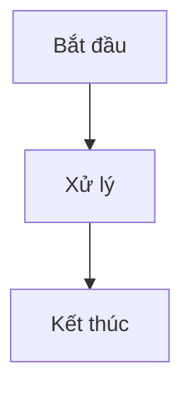
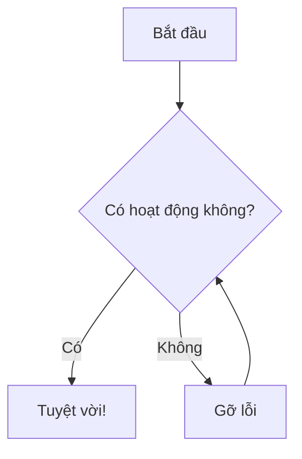
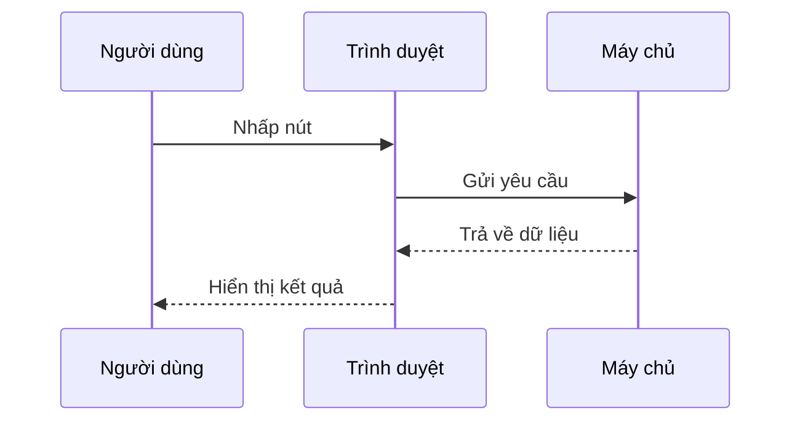
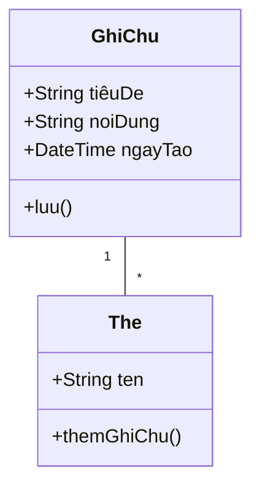
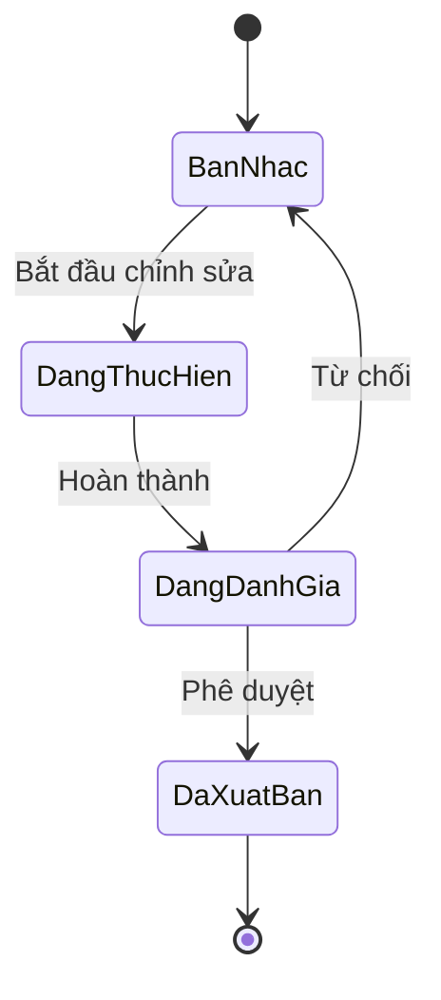
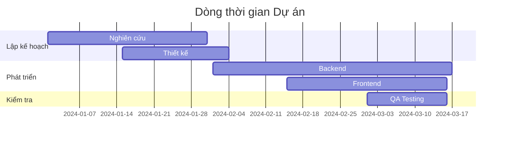
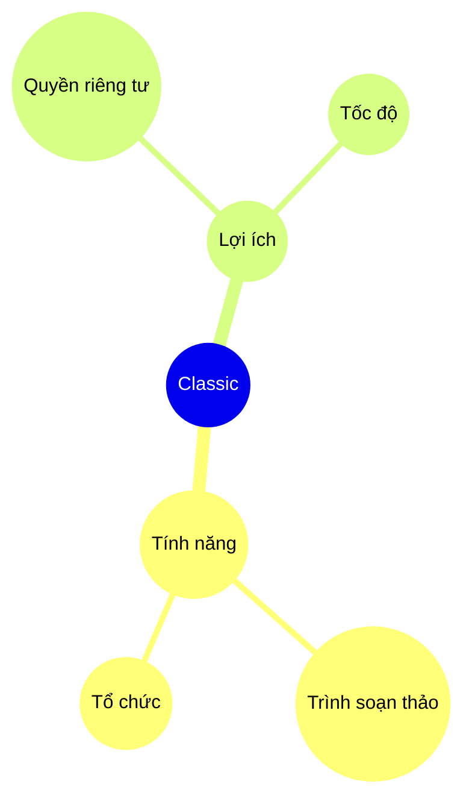

# Sơ đồ Mermaid

Tạo sơ đồ đẹp trực tiếp trong ghi chú của bạn sử dụng cú pháp Mermaid.

## Sử dụng Cơ bản

Để tạo sơ đồ Mermaid, sử dụng khối mã với định danh ngôn ngữ `mermaid`:

## Biểu đồ Luồng

## Sơ đồ Trình tự

## Sơ đồ Lớp

## Sơ đồ Trạng thái

## Biểu đồ Gantt

## Biểu đồ Tròn

## Sơ đồ Tư duy

## Mẹo

### Tạo kiểu

- Sử dụng subgraphs để tổ chức các sơ đồ phức tạp
- Thêm kiểu và chủ đề để nhất quán về mặt hình ảnh
- Giữ sơ đồ đơn giản và dễ đọc

### Hiệu suất

- Các sơ đồ lớn có thể làm chậm trình soạn thảo
- Cân nhắc chia các sơ đồ phức tạp thành các sơ đồ nhỏ hơn
- Sử dụng `%%{init: ... }%%` để cấu hình

### Các vấn đề Phổ biến

**Sơ đồ không hiển thị?**
- Kiểm tra cú pháp Mermaid
- Đảm bảo khối mã có ngôn ngữ `mermaid`
- Tìm lỗi cú pháp trong xem trước

**Sơ đồ quá nhỏ/lớn?**
- Sử dụng `%%{init: {'theme': 'base', 'themeVariables': { 'fontSize': '16px' }}}%%` để điều chỉnh kích thước

## Tài nguyên

- [Tài liệu Mermaid](https://mermaid.js.org/)
- [Trình soạn thảo trực tiếp Mermaid](https://mermaid.live/)
- [GitHub Mermaid](https://github.com/mermaid-js/mermaid)
