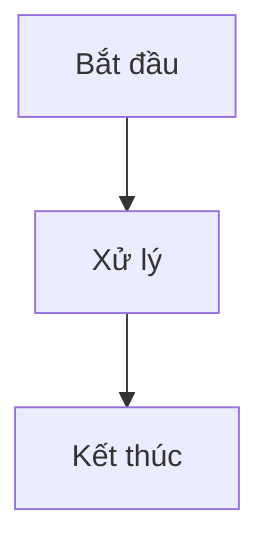

# Tham khảo Markdown

Classic hỗ trợ đầy đủ cú pháp Markdown với xem trước trực tiếp. Dưới đây là tham khảo toàn diện cho tất cả các tùy chọn định dạng được hỗ trợ.

## Định dạng Cơ bản

| Cú pháp | Kết quả |
|---------|---------|
| `**in đậm**` | **in đậm** |
| `*in nghiêng*` | *in nghiêng* |
| `~~gạch ngang~~` | ~~gạch ngang~~ |
| `# Tiêu đề 1` | Tiêu đề 1 |
| `## Tiêu đề 2` | Tiêu đề 2 |
| `### Tiêu đề 3` | Tiêu đề 3 |

## Liên kết

```markdown
[Liên kết nội tuyến](https://classic.app)

[Liên kết kiểu tham khảo][https://classic.app]
```

## Danh sách

```markdown
- Mục 1
- Mục 2
  - Mục con 2a
    - Mục con 2a
- Mục 3

1. Mục đầu tiên
2. Mục thứ hai
3. Mục thứ ba
```

## Khối Mã

Mã nội tuyến `code`:

```javascript
const greeting = "Xin chào, Thế giới!";
console.log(greeting);
```

Khối mã với ngôn ngữ:

```python
def greet(name):
    return f"Xin chào, {name}!"

print(greet("Classic"))
```

## Trích dẫn khối

```markdown
> Đây là một trích dẫn khối.
> Nó có thể chứa nhiều đoạn văn.
>
> — Ai đó nổi tiếng
```

## Quy tắc Ngang

```markdown
---
```

## Bảng

| Tính năng | Trạng thái |
| --------- | ---------- |
| Markdown | ✅ Hỗ trợ đầy đủ |
| Xem trước Trực tiếp | ✅ Có |
| Lệnh Slash | ✅ Có |

## Danh sách Việc cần làm

```markdown
- [x] Việc 1
- [ ] Việc 2
- [x] Việc 3
```

## Hình ảnh

```markdown

```

## Chú thích cuối trang

```markdown
Đây là một số văn bản với chú thích.[^1]

[^1]: Đây là chú thích.
```

## Ký tự Đặc biệt

| Ký tự | Mã thoát | Kết quả |
|-------|----------|---------|
| `<` | `&lt;` | `<` |
| `>` | `&gt;` | `>` |
| `&` | `&amp;` | `&` |

## Tính năng Nâng cao

### Sơ đồ Mermaid

Tạo sơ đồ sử dụng cú pháp Mermaid:



### Phương trình Toán học

Sử dụng KaTeX cho các biểu thức toán học:

```markdown
$$E = mc^2$$
```

Toán học nội tuyến: $E = mc^2$

### Tô sáng Cú pháp

Classic hỗ trợ tô sáng cú pháp cho hơn 100 ngôn ngữ lập trình.
