# Mermaid 图表

Classic 支持使用 Mermaid 语法创建图表和流程图。无需外部工具，直接在笔记中可视化您的想法。

## 基本语法

使用代码块创建 Mermaid 图表：

````markdown
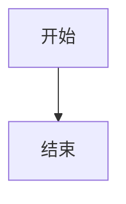
````

## 流程图

### 从上到下

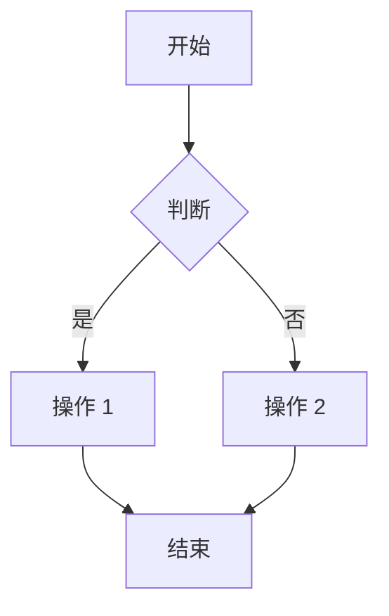

### 从左到右


### 节点形状


### 连接线

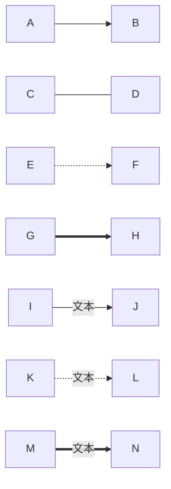

## 时序图

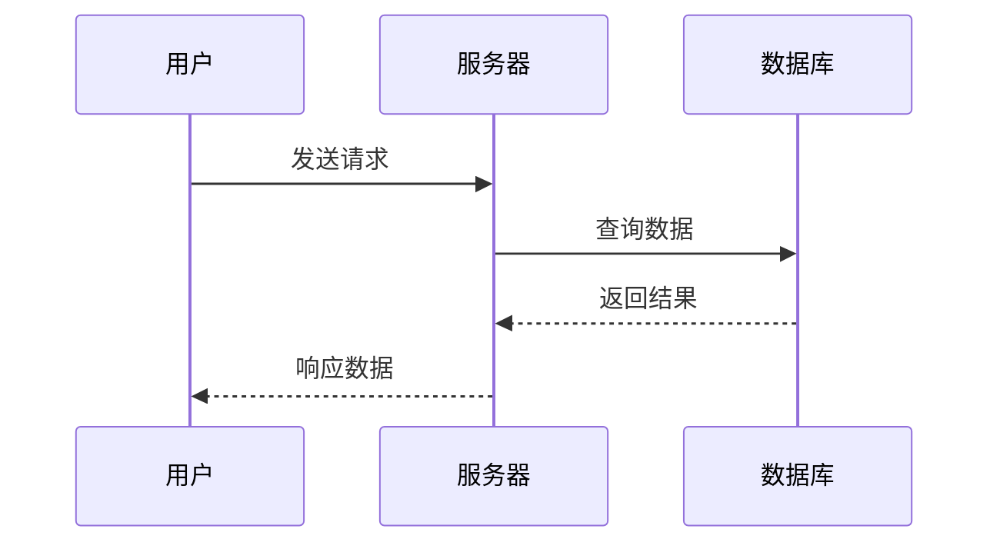

### 激活框

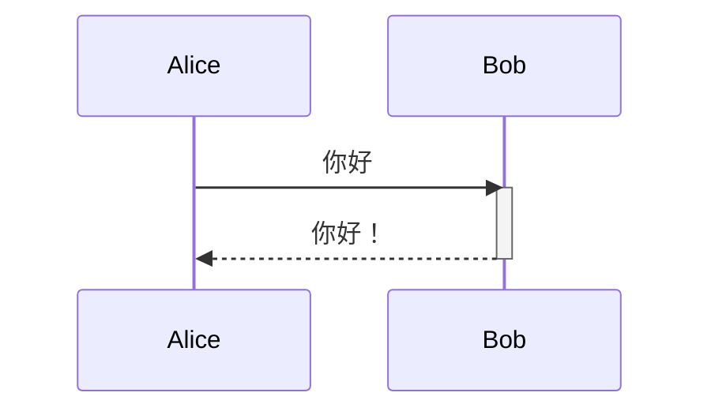

## 类图

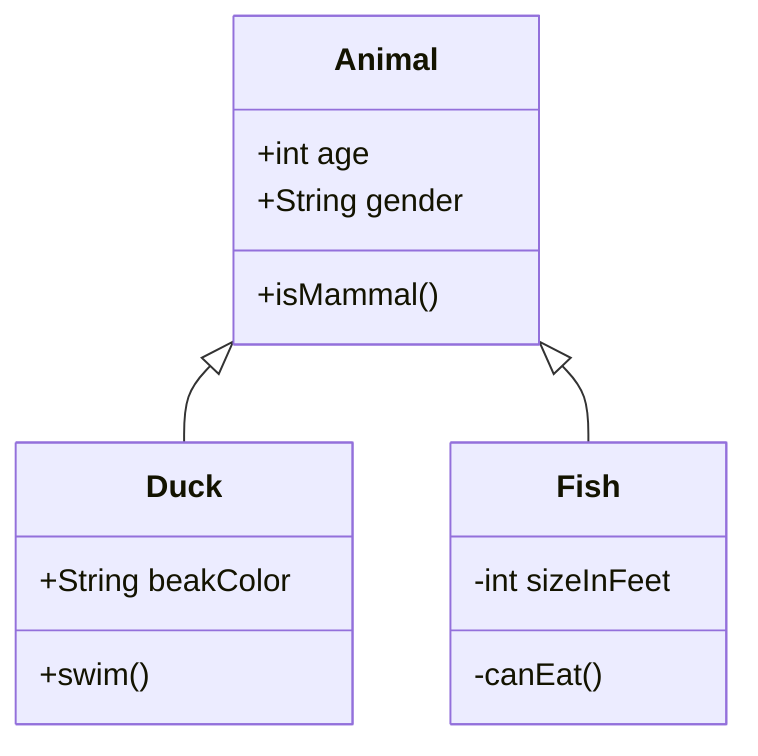

## 状态图

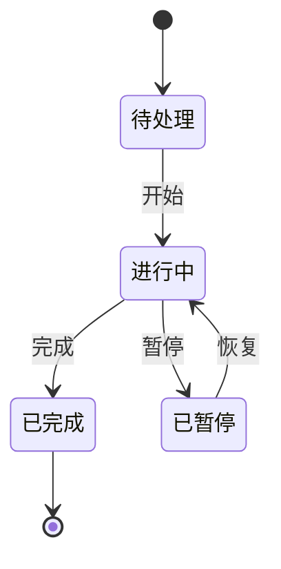

## 饼图

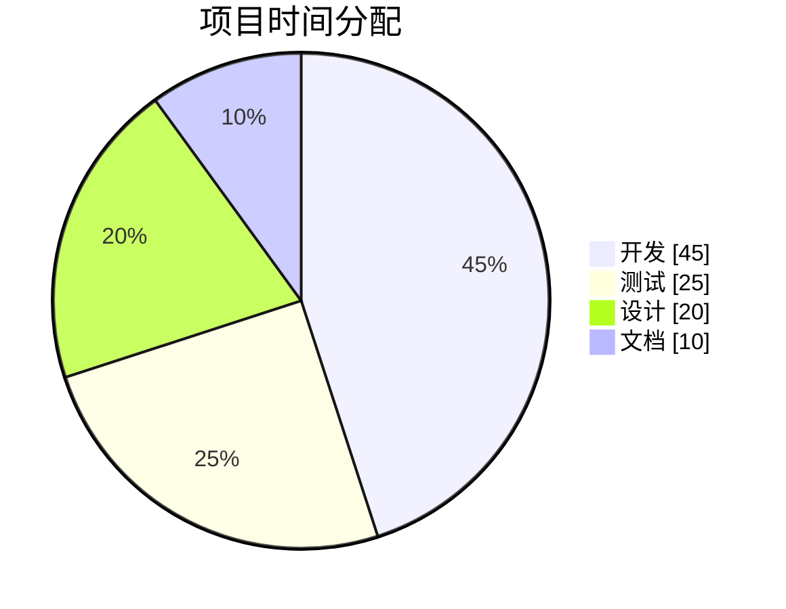

## 甘特图

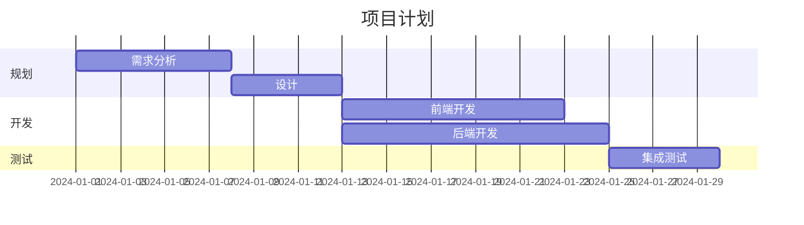

## 思维导图

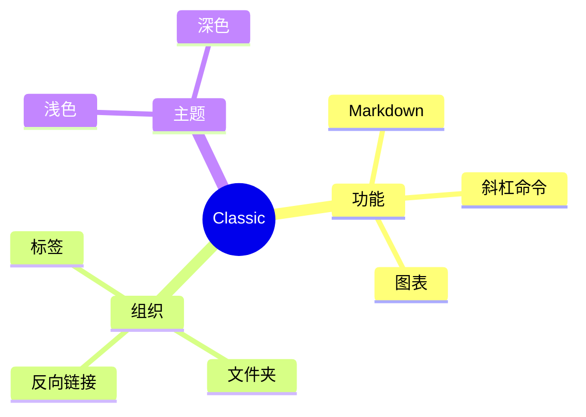

## ER 图

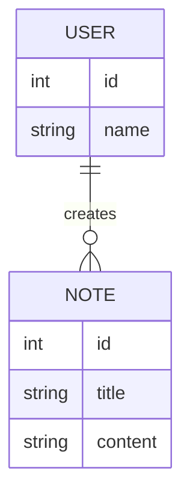

## 技巧

### 样式

使用 `style` 关键字自定义节点样式：

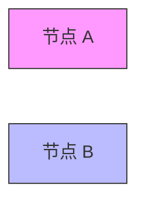

### 子图

将相关节点分组：

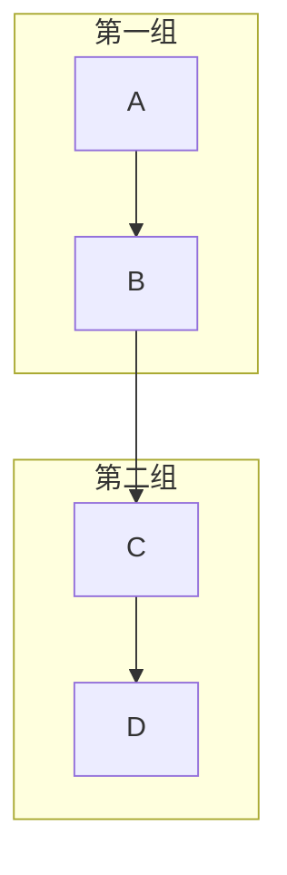

### 链接

添加可点击链接：


