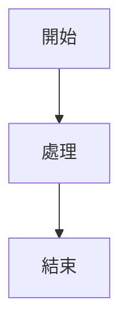
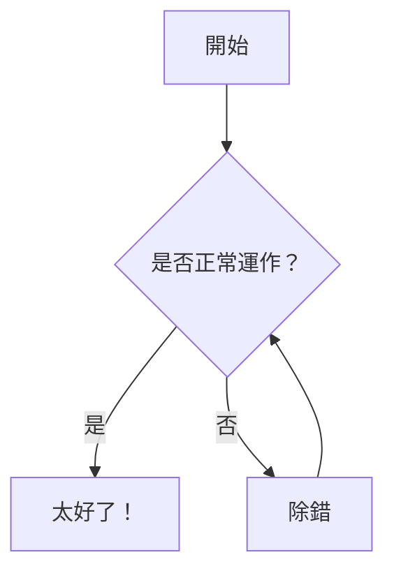
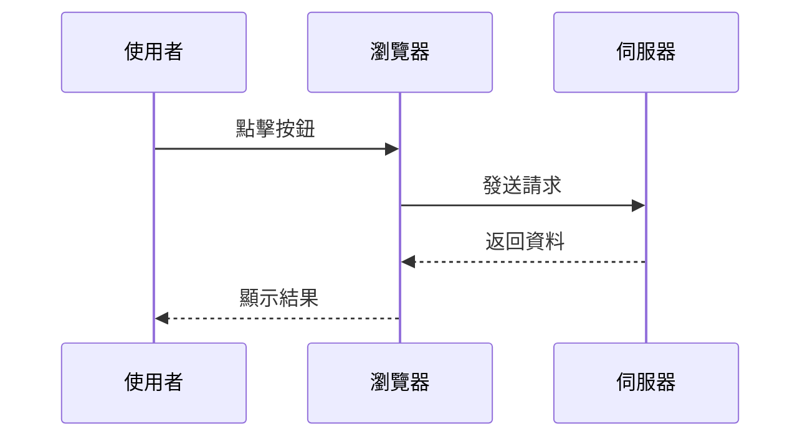
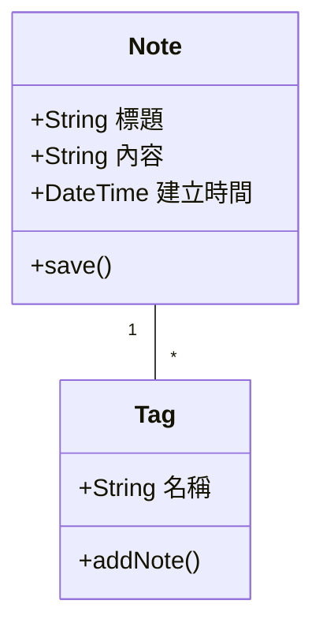
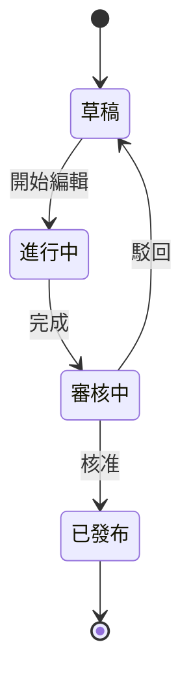
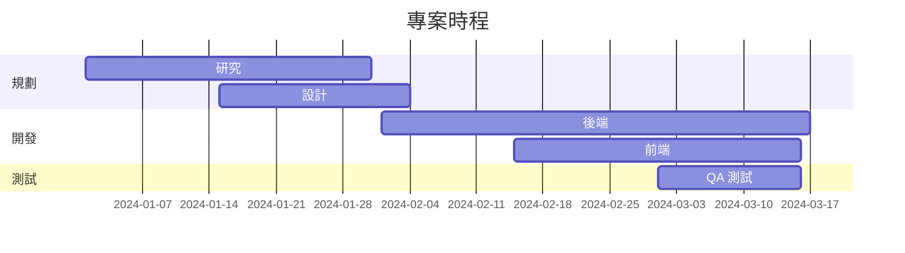
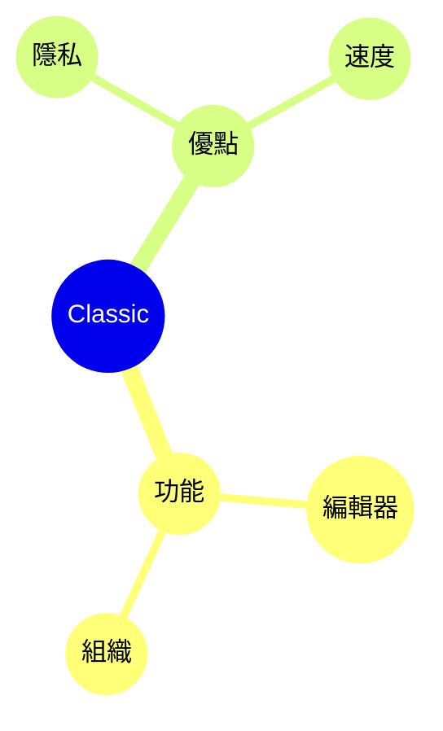

# Mermaid 圖表

使用 Mermaid 語法直接在筆記中建立精美的圖表。

## 基本用法

要建立 Mermaid 圖表，請使用帶有 `mermaid` 語言識別碼的程式碼區塊：

## 流程圖

## 時序圖

## 類別圖

## 狀態圖

## 甘特圖

## 圓餅圖

## 心智圖

## 提示

### 樣式

- 使用子圖表組織複雜圖表
- 加入樣式和主題以保持視覺一致性
- 保持圖表簡單易讀

### 效能

- 大型圖表可能會拖慢編輯器
- 考慮將複雜圖表拆分為較小的圖表
- 使用 `%%{init: ... }%%` 進行設定

### 常見問題

**圖表無法渲染？**
- 檢查 Mermaid 語法
- 確保程式碼區塊有 `mermaid` 語言標記
- 查看預覽中的語法錯誤

**圖表太小/太大？**
- 使用 `%%{init: {'theme': 'base', 'themeVariables': { 'fontSize': '16px' }}}%%` 調整大小

## 資源

- [Mermaid 文件](https://mermaid.js.org/)
- [Mermaid 線上編輯器](https://mermaid.live/)
- [Mermaid GitHub](https://github.com/mermaid-js/mermaid)
