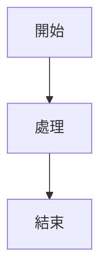

# Markdown 參考

Classic 支援完整的 Markdown 語法並提供即時預覽。以下是所有支援的格式化選項的完整參考。

## 基本格式

| 語法 | 結果 |
|------|------|
| `**粗體**` | **粗體** |
| `*斜體*` | *斜體* |
| `~~刪除線~~` | ~~刪除線~~ |
| `# 標題 1` | 標題 1 |
| `## 標題 2` | 標題 2 |
| `### 標題 3` | 標題 3 |

## 連結

```markdown
[行內連結](https://classic.app)

[參考式連結][https://classic.app]
```

## 列表

```markdown
- 項目 1
- 項目 2
  - 巢狀項目 2a
    - 巢狀項目 2a-1
- 項目 3

1. 第一項
2. 第二項
3. 第三項
```

## 程式碼區塊

行內 `程式碼`：

```javascript
const greeting = "Hello, World!";
console.log(greeting);
```

帶語言的程式碼區塊：

```python
def greet(name):
    return f"Hello, {name}!"

print(greet("Classic"))
```

## 區塊引言

```markdown
> 這是一個區塊引言。
> 它可以包含多個段落。
>
> — 某位名人
```

## 水平分隔線

```markdown
---
```

## 表格

| 功能 | 狀態 |
| ---- | ---- |
| Markdown | ✅ 完整支援 |
| 即時預覽 | ✅ 是 |
| 斜線命令 | ✅ 是 |

## 任務列表

```markdown
- [x] 任務 1
- [ ] 任務 2
- [x] 任務 3
```

## 圖片

```markdown

```

## 註腳

這是一些帶有註腳的文字。[^1]

[^1]: 這是註腳內容。
```

## 跳脫字元

| 字元 | 跳脫碼 | 結果 |
|------|--------|------|
| `<` | `&lt;` | < |
| `>` | `&gt;` | > |
| `&` | `&amp;` | & |

## 進階功能

### Mermaid 圖表

使用 Mermaid 語法建立圖表：



### 數學公式

使用 KaTeX 撰寫數學表達式：

```markdown
$$E = mc^2$$
```

行內數學：$E = mc^2$

### 語法高亮

Classic 支援超過 100 種程式語言的語法高亮。
